Sale Project Milestone
======================

.. contents:: Table of Contents

Technical
---------

Add field sale_line_id in milestone, to store sale line which generated it.
Add field milestone_sale_line_id in task which is related field of field sale_line_id in milestone
Add field milestoone_id in sale order line to store milestone generated by sale line

Description
-----------

It is not possible to create a product with a template milestone and a template project

I create a project without reference to a sale order, to use as project where to add a milestone

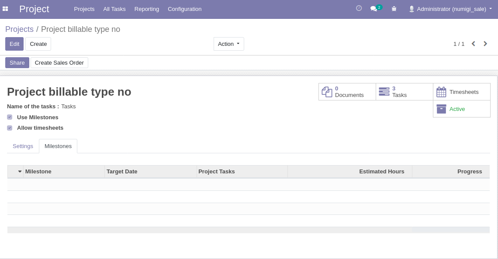

I create a project without reference to a sale order, to use as project template,
to copy its tasks associated to project and milestone to create

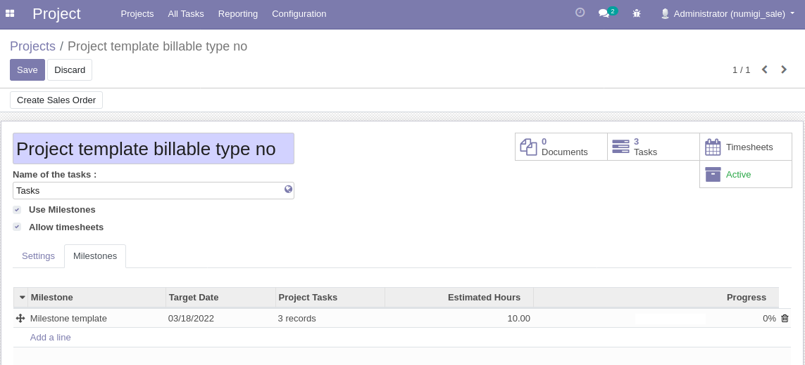

I create a milestone without reference to a sale line, to use as template,
to copy its tasks associated to project and milestone to create

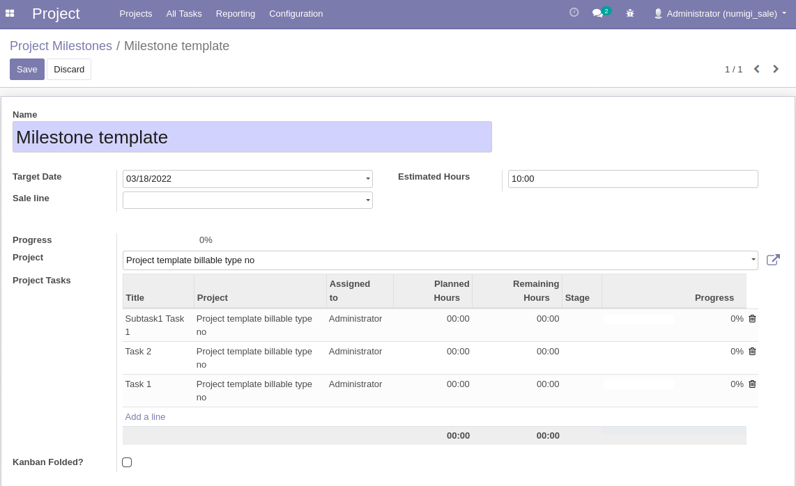

I create a product new milestone to create in an existing project

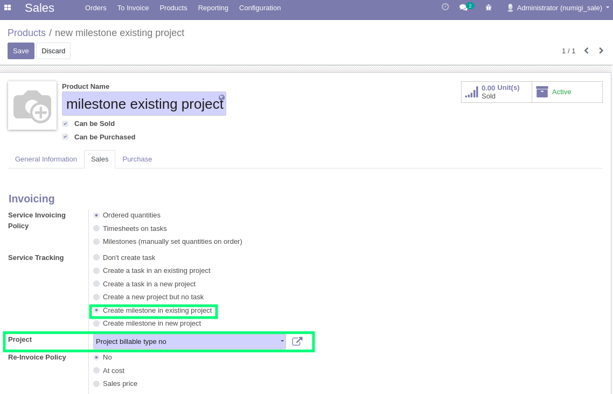

I create a product new milestone to create in a new project

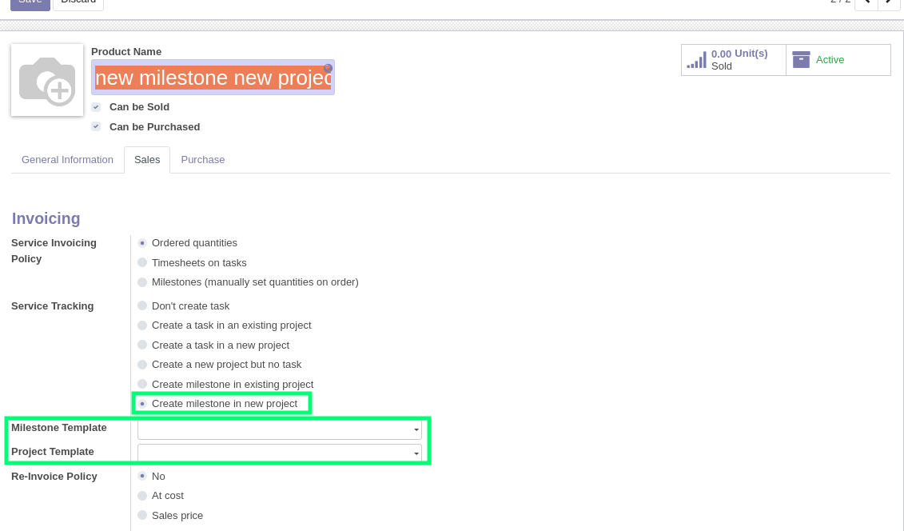

I create a product new milestone with template project

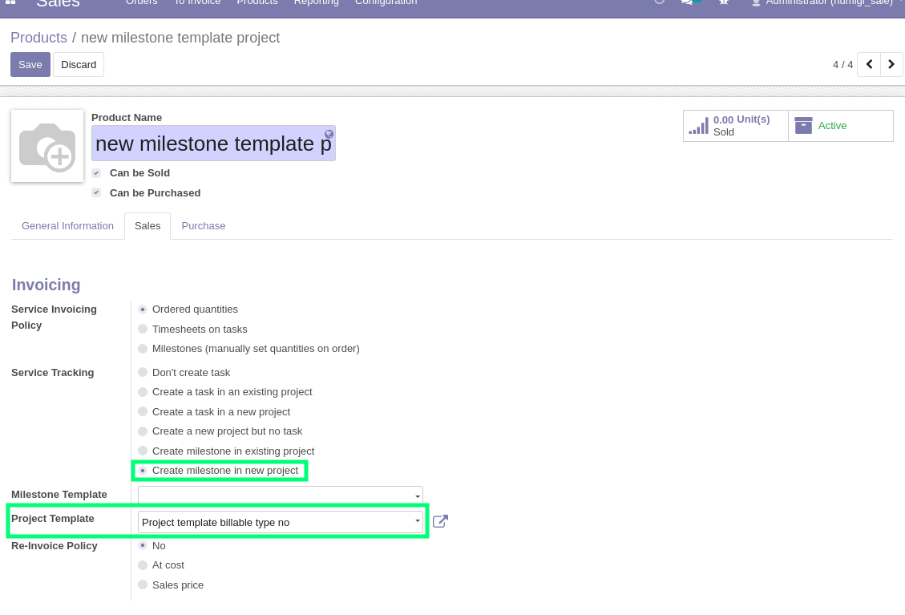

I create a product with template milestone in a new project

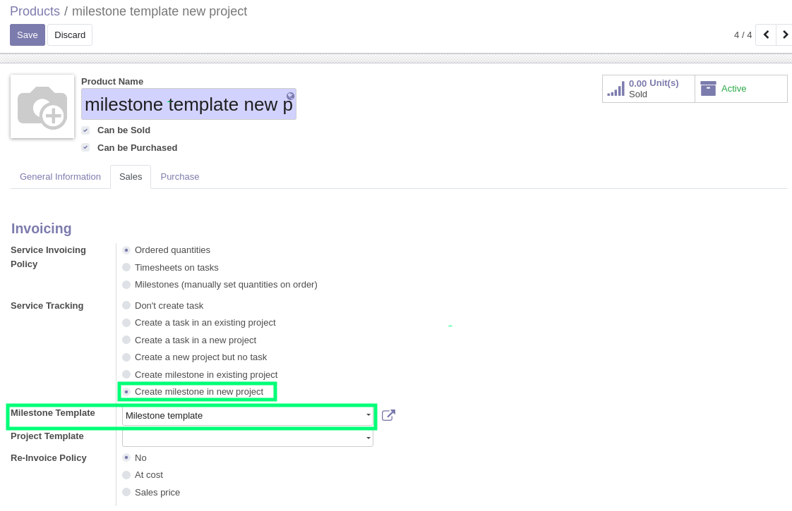

I create and confirm a sale order with a product which create a milestone in an existing project

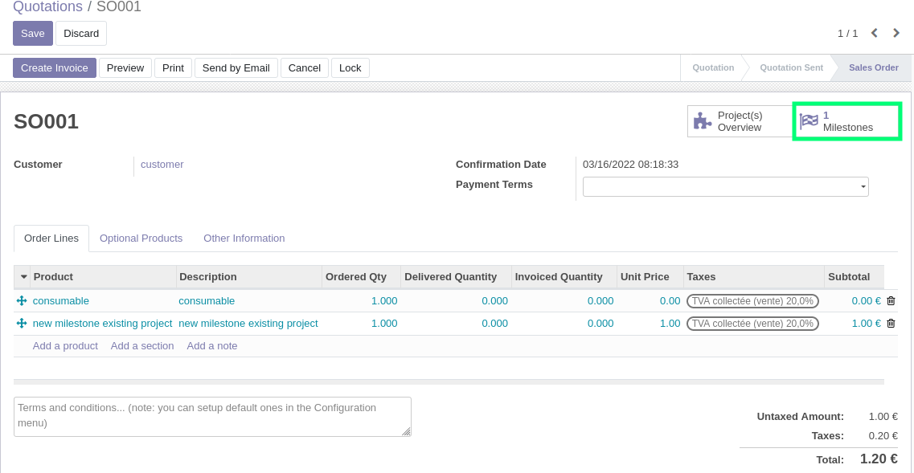

I display the milestone generated

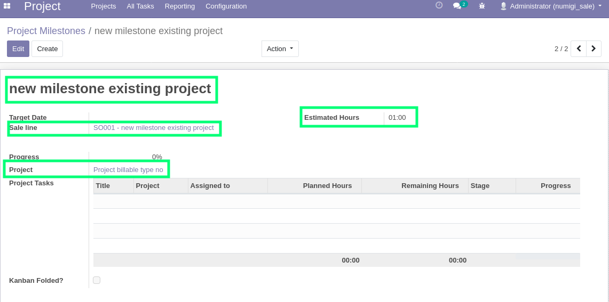

I create and confirm a sale order with a product which create a new milestone and a new project

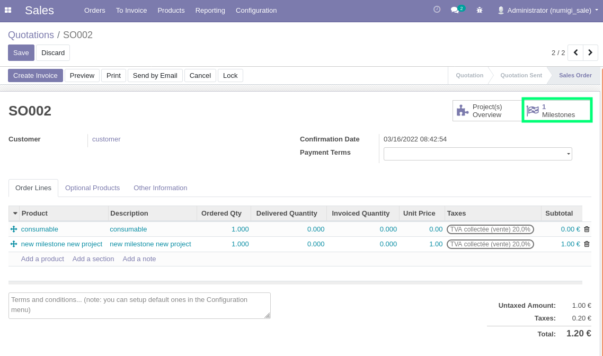

I display the milestone generated

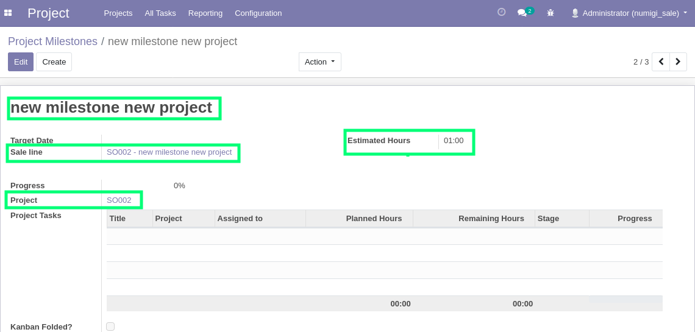

I create and confirm a sale order with a product which create a new milestone with a project template

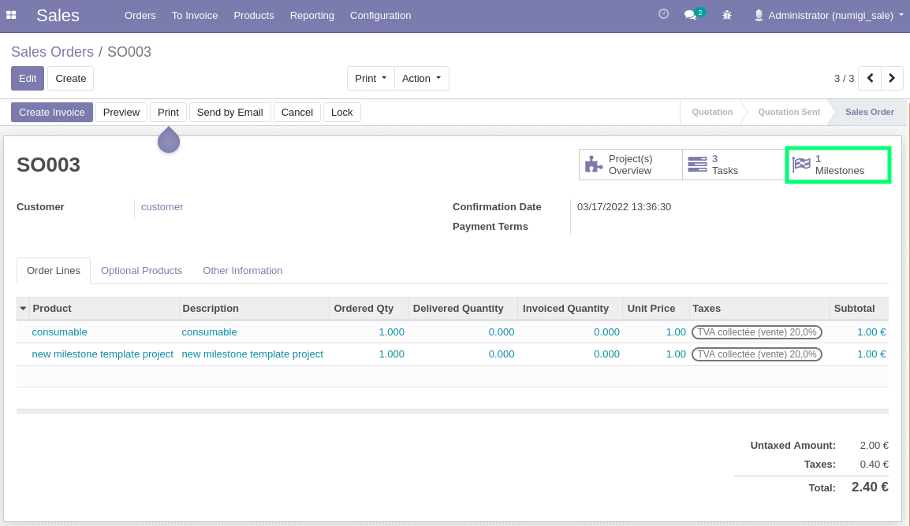

I display the milestone generated

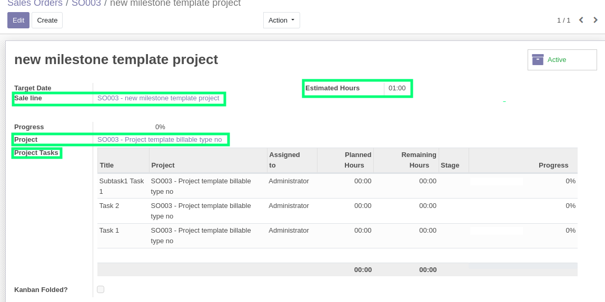

I create and confirm a sale order with a product with a milestone template and create a new project

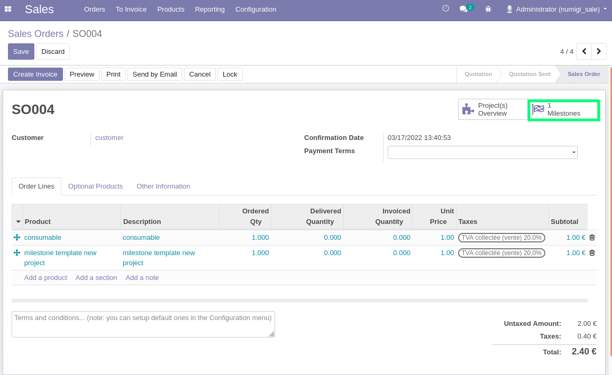

I display the milestone generated

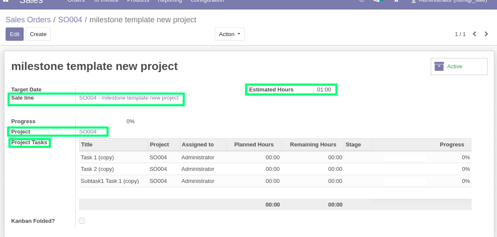

Contributors
------------
* Numigi (tm) and all its contributors (https://bit.ly/numigiens)
