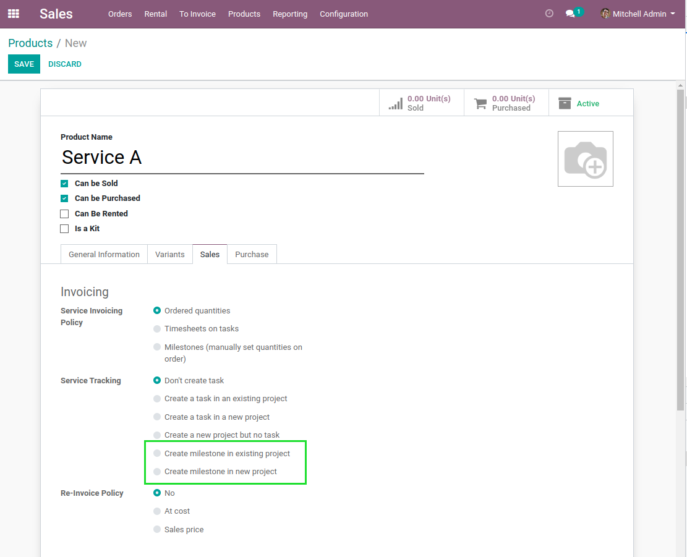
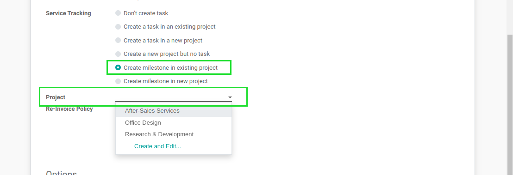
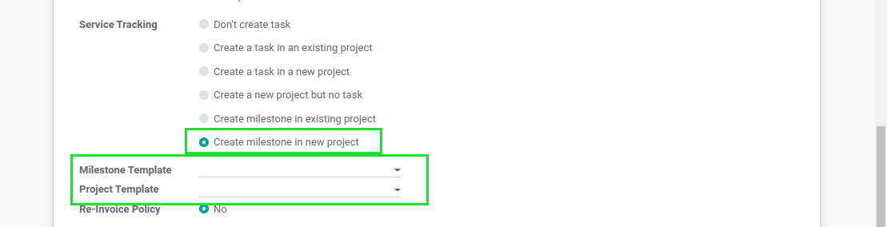
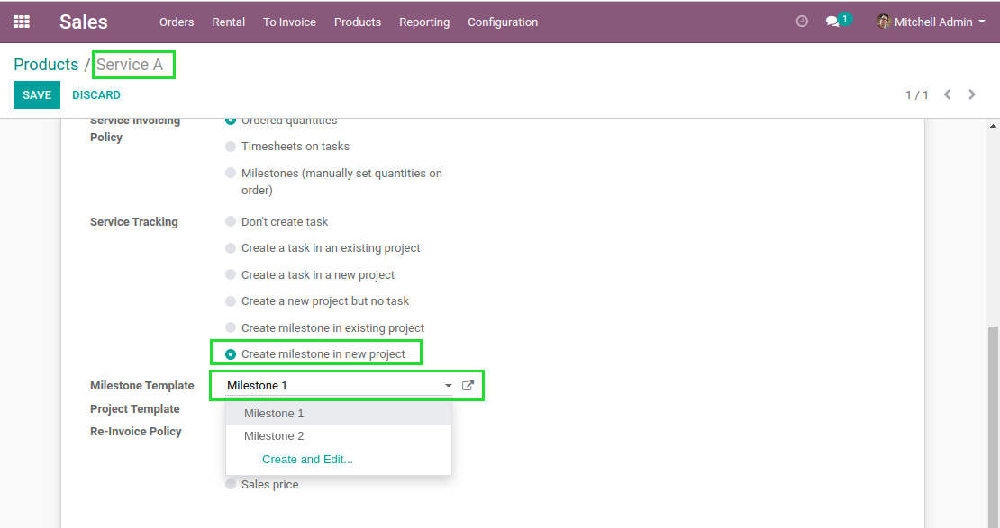
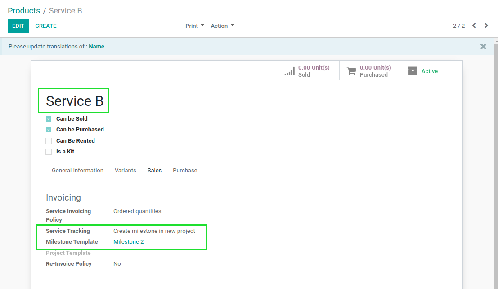
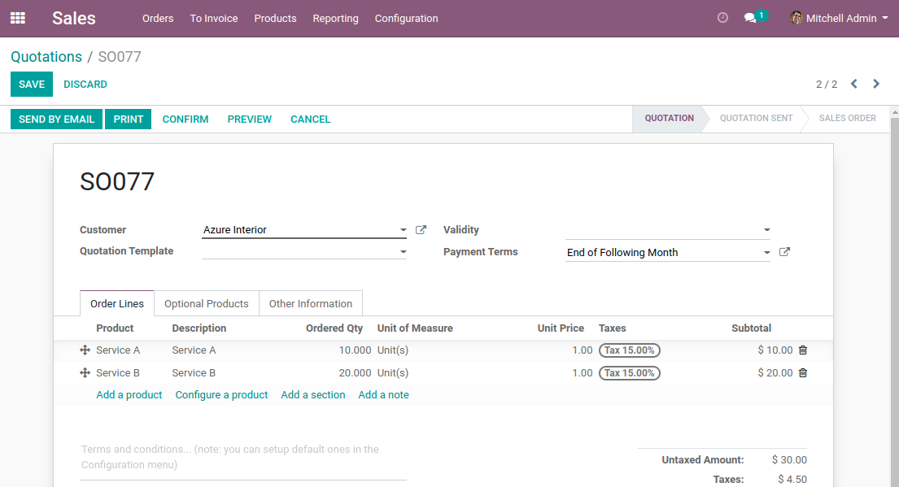
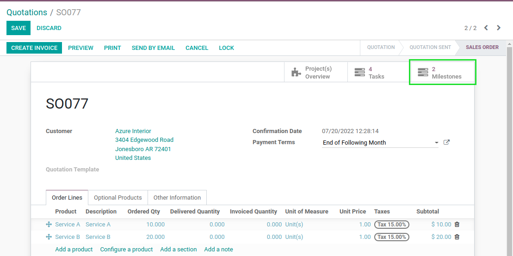
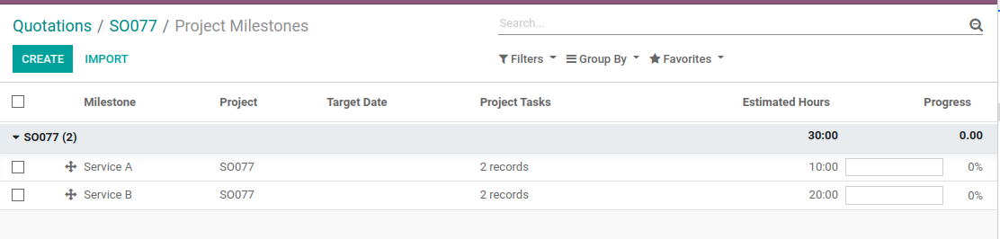
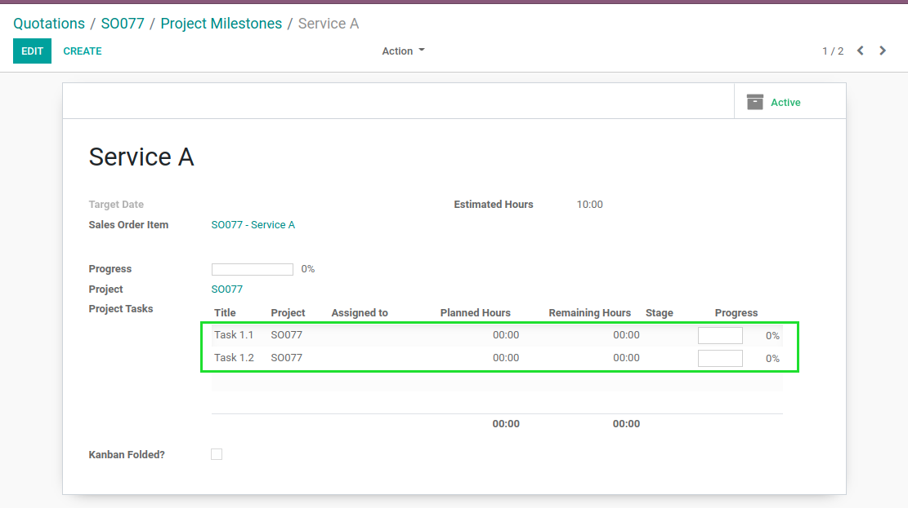
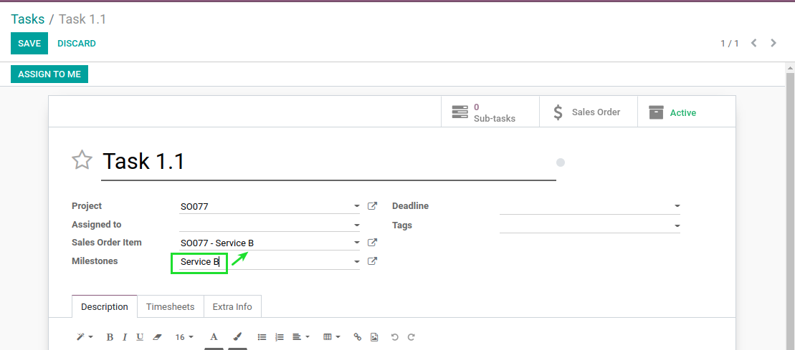

Sale Project Milestone
======================

.. contents:: Table of Contents

Context
-------
In vanilla Odoo, it is possible to generate tasks and projects when confirming a sales order.

The module `project_milestone <https://github.com/OCA/project/tree/12.0/project_milestone>`_ allows to define milestones on tasks.

.. image:: static/description/task_with_milestone.png

Description
-----------
This module allows to generate a milestone in a project when confirming a sales order (instead of generating a task).

Then, each task linked to this milestone is automatically linked to the sales order line.

Configuration
-------------
In the form view of a product of type service, I find new options under ``Service Tracking``.

* Create milestone in existing project
* Create milestone in new project

Create milestone in existing project
~~~~~~~~~~~~~~~~~~~~~~~~~~~~~~~~~~~~
When selecting this option, a project must be selected.

Each sales order line will generate a new milestone in the selected project.

The title of milestone is the description of the sales order line.

Create milestone in new project
~~~~~~~~~~~~~~~~~~~~~~~~~~~~~~~
When selecting this option, you may either select a project template or a milestone template.

Each sales order line will generate a new milestone in a project.

Milestone Template
******************
This field allows to select a milestone linked to a non-billable project.

If a milestone template is selected, it is used to create the new milestone for the sales order line.

All tasks and subtasks linked to the milestone template are copied into the new milestone.

Project Template
****************
If a project template is selected, a new project will be created based on this template.
Otherwise, a global project is created for the sales order.

If two lines in the same order use the same template project, the same project is reused for both lines.
This behavior is coherent with the option ``Create a task in a new project``.

Usage
-----
I create a new product with the option ``Create milestone in new project``.

I select a milestone template for this product.

I create a second product with a different milestone template.

I create a sales order with the two products.

After confirming the sales order, I notice a smart button ``Milestones``.

After clicking on the button, two milestones are shown.

After clicking on the first milestone, the related tasks are displayed.

In the form view of a task, if I change the milestone, the related sales order line is updated.

Contributors
------------
* Numigi (tm) and all its contributors (https://bit.ly/numigiens)
