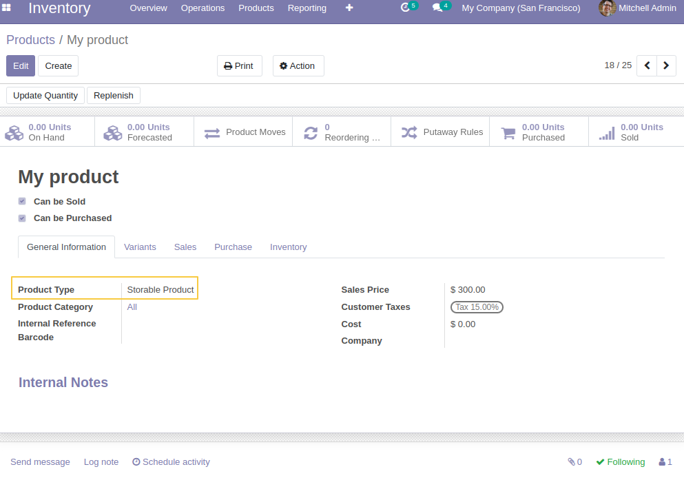
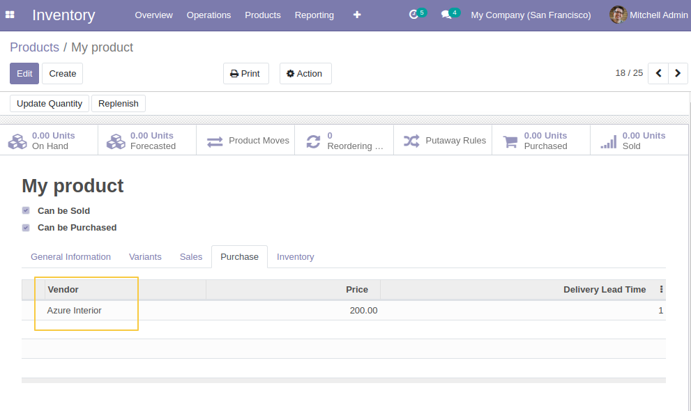
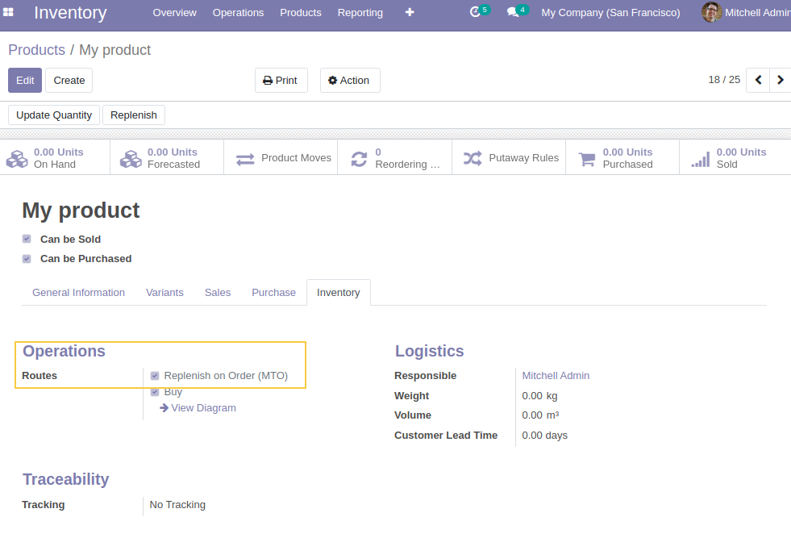
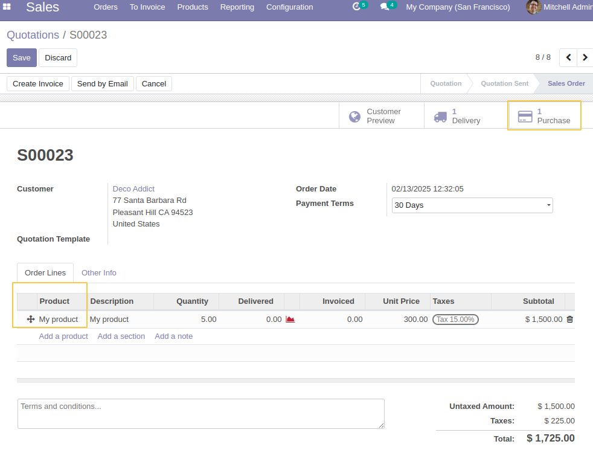
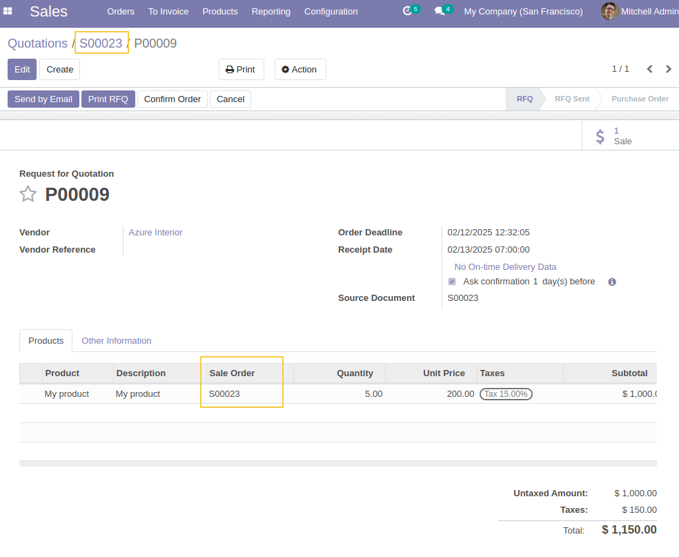
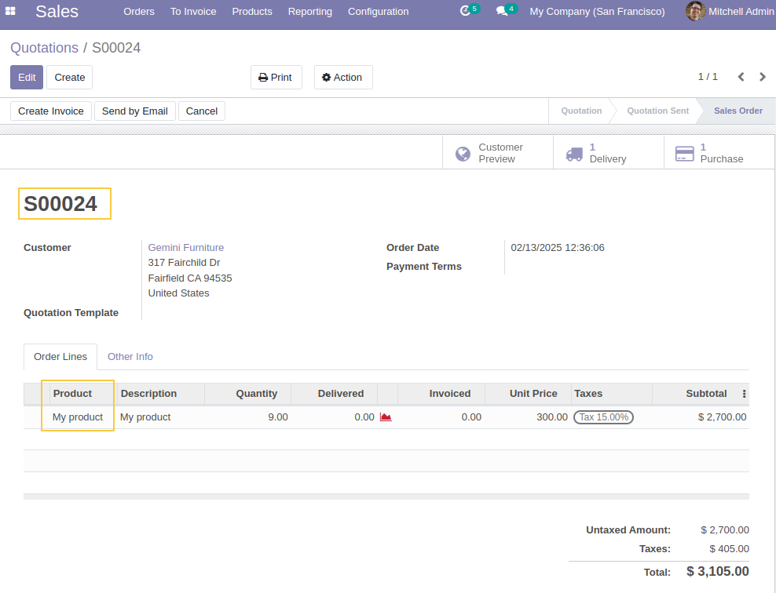
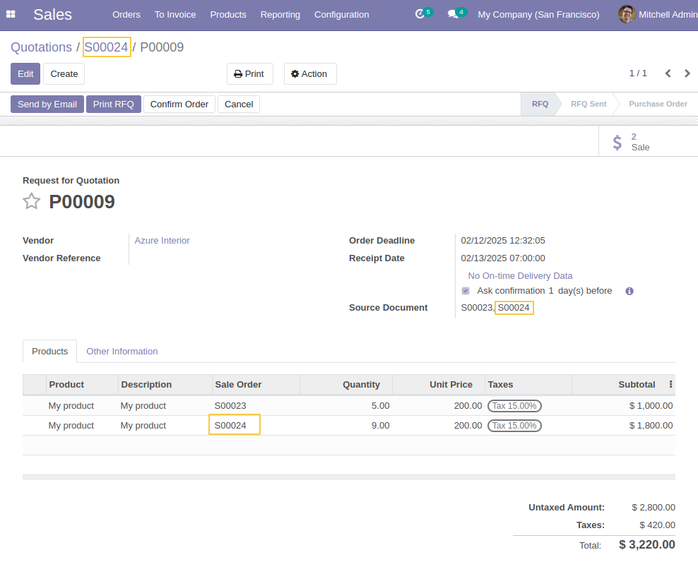

Sale Purchase Procurement Link
==============================

This module adds sale order information to purchase order lines coming from procurement.

It works only for products with the "Replenish on Order (MTO)" route configured in inventory operations.

This module depends on `purchase_line_procurement_no_grouping <https://github.com/Numigi/odoo-purchase-addons/tree/14.0/purchase_line_procurement_no_grouping>`_ to prevent the grouping of purchase order lines when they are linked to different procurements.

Description:
============

This module displays the `Sale Order` field in purchase order lines.
It automatically fills the `Sale Order Line` field when generating purchase order lines from procurement.

How it works:
=============

Create a new product:

Set a vendor for the product:

Enable the `Replenish on Order (MTO)` route (This route is archived by default, so make sure to activate it.):

Create and confirm a sale order for the product in the Sales app:

A purchase order is generated for the sale order.

In the purchase order, a new `Sale Order` field is displayed in the PO lines, containing the corresponding SO reference.

Create and confirm another sale order for the same product:

In the linked purchase order, a new line is added for the same product, referencing the second sale order.

Contributors
------------

* The `Numigi <https://numigi.com/r/home>`_ team is the contributor to this project. We help Quebec companies implement Odoo and Konvergo ERP.
