Sale Rental
===========
This module allows to rent products using the ``Sales`` application.

.. contents:: Table of Contents

Product Configuration
---------------------
In the form view of a product, I notice a new checkbox ``Can Be Rented``.

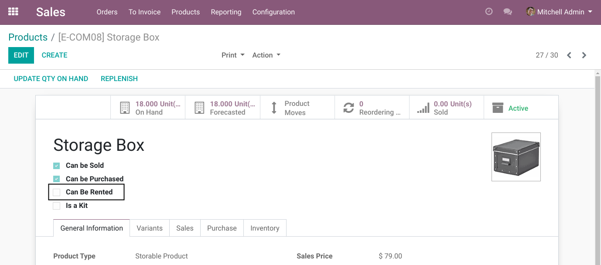

When the box is checked, in the ``Sales`` tab, a new field `Rental Service`_ appears.

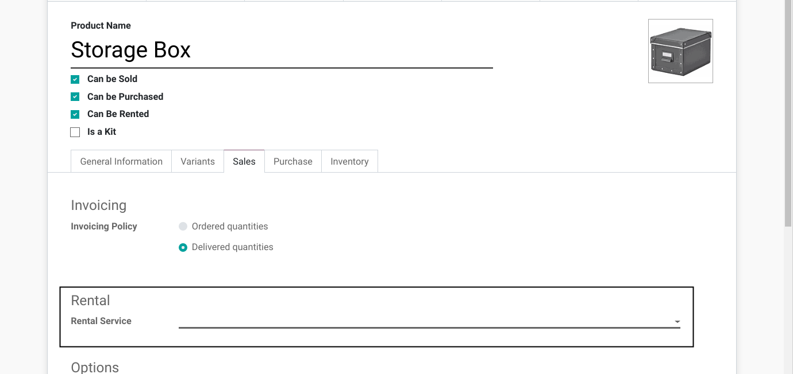

Rental Service
~~~~~~~~~~~~~~
This field allows to select the product used to invoice the customer based on the number of rental days.

I create a new product for the rental service.

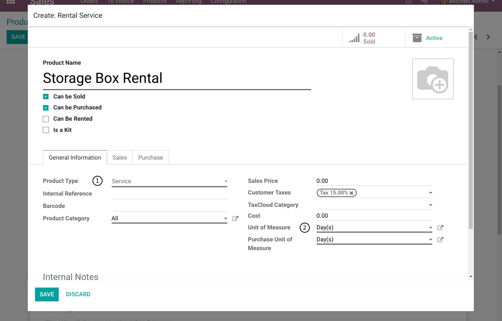

The product type must be ``Service`` and the unit of measure must be ``Day(s)``.
Otherwise, an error message will be raised when the rentable product is saved.

Kit
~~~
A product that can be rented can also be a `kit <https://github.com/Numigi/odoo-sale-addons/tree/12.0/sale_kit>`_.

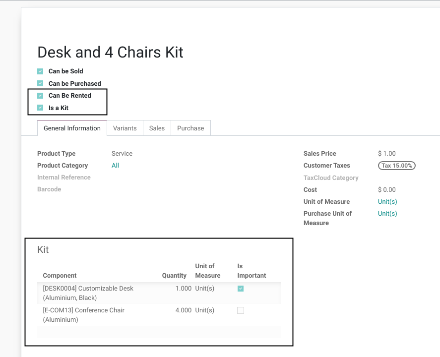

When a rentable product is a kit, the product is considered delivered and returned
when all important components of the kit are delivered / returned.

Sale Order
----------
I create a new sale order.

I notice a new checkbox ``Is Rental``.

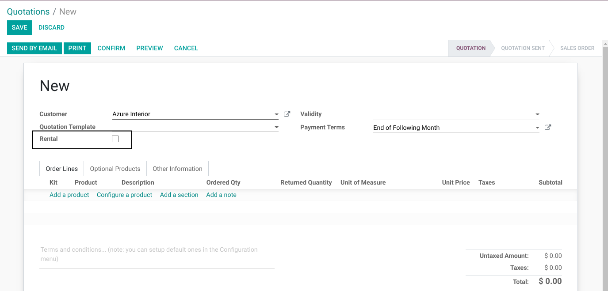

When checked, new columns are added to the sale order lines.

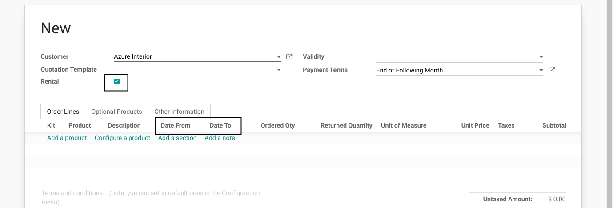

Sale Order Lines
~~~~~~~~~~~~~~~~
In a new line, I select my rentable product.

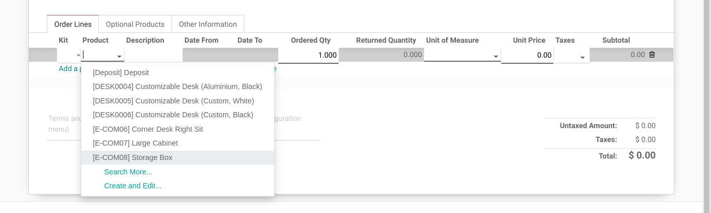

Automatically, when the product is selected, a new line is added below for the rental service associated to this product.

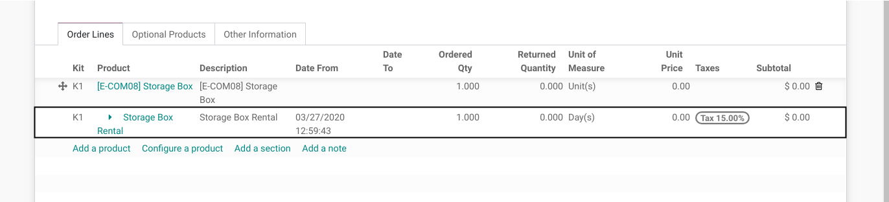

I notice that:

1. The rental service line can not be moved (see `Moving Sale Order Lines`_).
2. The product can not be changed.
3. The unit of measure is day(s) and can not be changed.
4. The line can not be deleted.

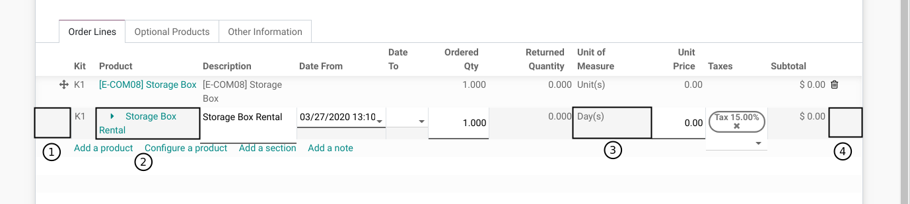

The rental start date is automatically set to the current date.

I manually change the start date and select an end date.

The number of days is filled automatically.

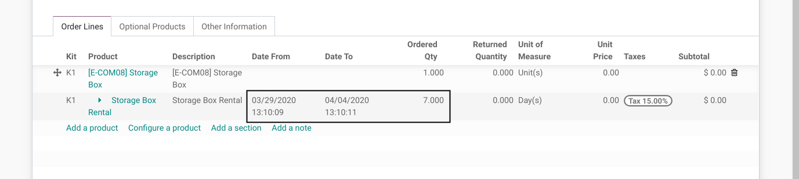

Confirmation
~~~~~~~~~~~~
After confirming the sale order, 2 smart buttons appear.

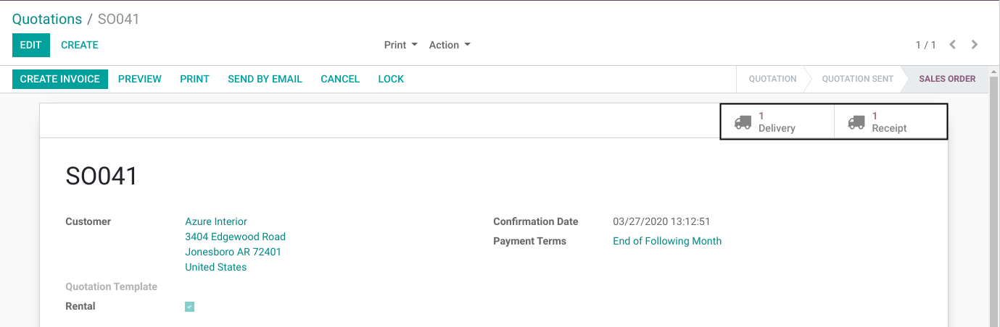

When I click on the ``Delivery`` button, I see the delivery picking.

The delivery is automatically scheduled for the rental start date.

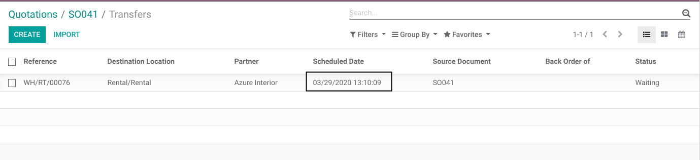

When I click on the ``Receipt`` button, I see the return picking.

The return is automatically scheduled for the rental end date.

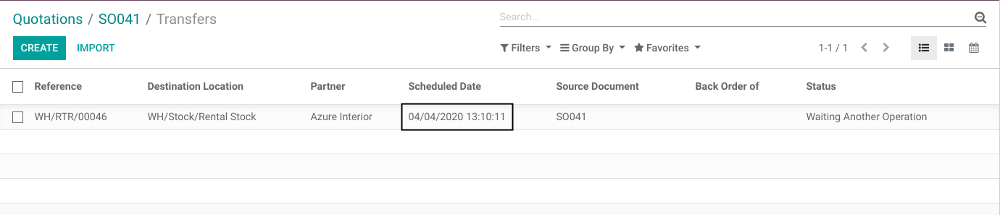

Delivery
~~~~~~~~
The delivery stock picking of a rented product works the same way as in a standard sale.

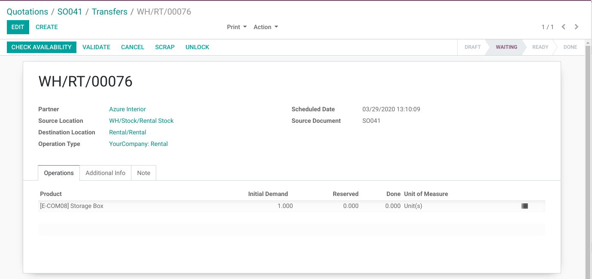

When the product is delivered, the delivered quantity of the rental service
is computed based on the rental start date.

..

    Delivered Qty = (Rental Start Date - Current Date) + 1 Day

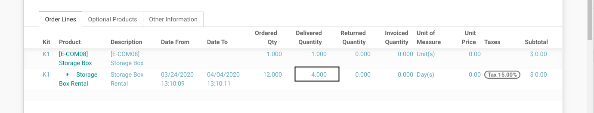

When a rented product is delivered but not returned,
the delivered quantity of the rental service is updated every day based on a cron.

Receipt
~~~~~~~
The return stock picking of a rented product is similar to a receipt picking.

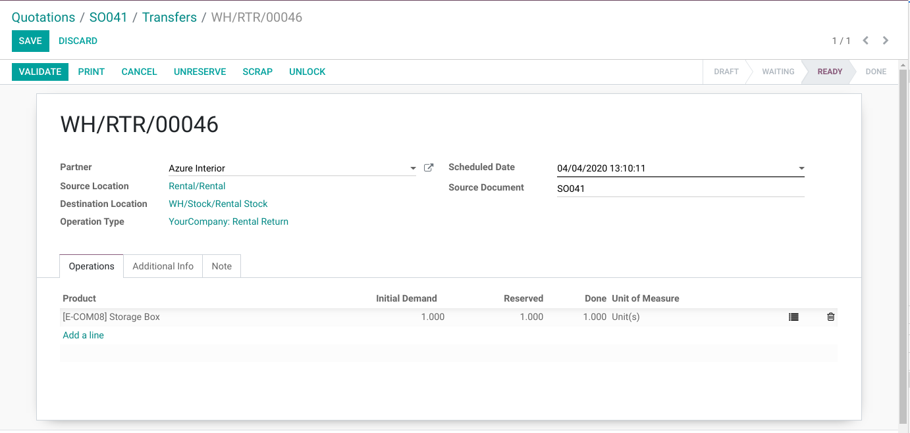

When the product is returned, the delivered quantity of the rental service
is equal to the ordered quantity.

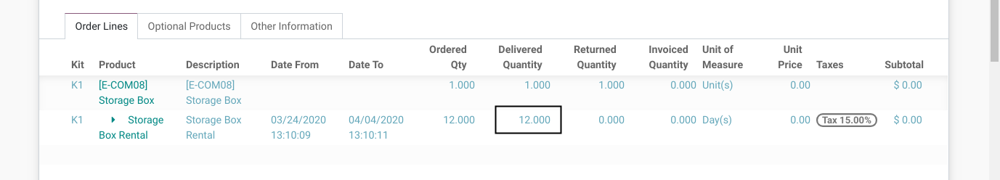

The rental start and end date can be edited manually.
This allows to adjust what must be charged to the customer based on your company's policies.

Renting a Kit
-------------
Instead of a stockable product, you may select a kit on a rental sale order.

In this case, the rental service is added above the first component of the kit.

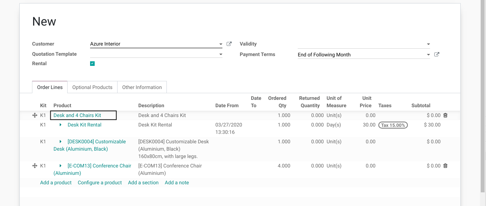

Delivered Quantities
~~~~~~~~~~~~~~~~~~~~
When renting a kit, the delivered and returned quantities are
computed based on the important components.

..

    A kit is considered delivered when all important components are delivered.
    It is considered returned when all important components are returned.

Rental Route
------------
A rental sale order uses a special route.

This route is automatically created for each warehouse.

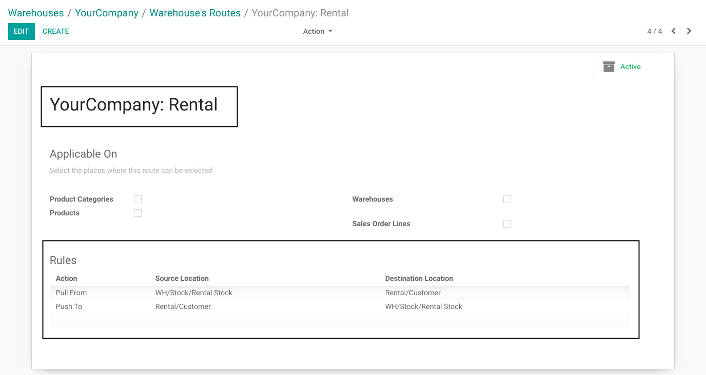

The route contains a pull from `Rental Stock`_ to `Rental Customer`_
and a push from `Rental Customer`_ back to `Rental Stock`_.

Rental Stock
~~~~~~~~~~~~
This is an internal location defined below the root location of the warehouse.

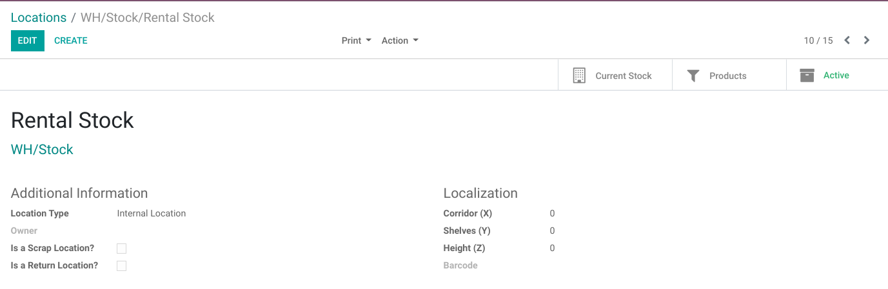

It is used for stocks available for rental.

This location is separated from the warehouse inventory location for stocks available for sale.

Rental Customer
~~~~~~~~~~~~~~~
This is a unique location used for every rental.

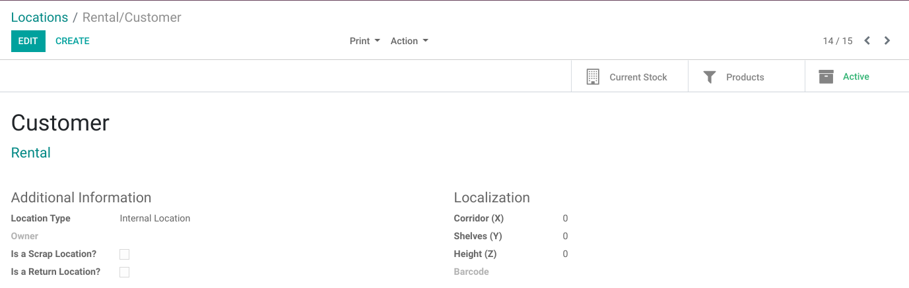

This location is not bound to a warehouse.

It is of type ``Internal`` (not ``Customer``).
This prevents the rented products from being deduced from the accounting inventory.

Rental Transit
~~~~~~~~~~~~~~
This location is used for products in transit between `Rental Stock`_ and `Rental Customer`_.

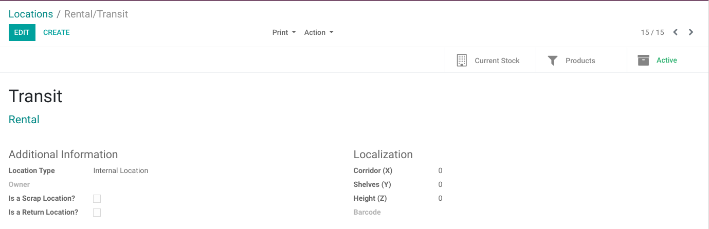

For example, it can represent a truck, transporting the products to the customer
or back to the warehouse.

This location is created by default and is not bound to a specific warehouse.

By default, it is not used on the rental route.
You may add a stock rule to the route if you need it (see `Editing The Rental Route`_).

Editing The Rental Route
~~~~~~~~~~~~~~~~~~~~~~~~
You may edit the rental route of a warehouse and the stock rules defined on it.

Your changes will not be overriden when updating the module.

For example, you could add a second delivery or receipt step to the route.

Advanced Usage
--------------

Moving Sale Order Lines
~~~~~~~~~~~~~~~~~~~~~~~
A rental service line can not be moved.

However, if the related rented product or kit is moved, then the rental service will follow.
This is the same behavior as for the components of a kit.

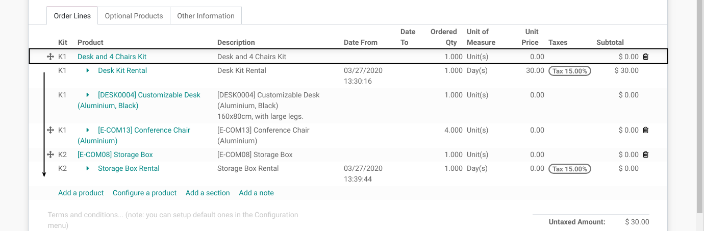

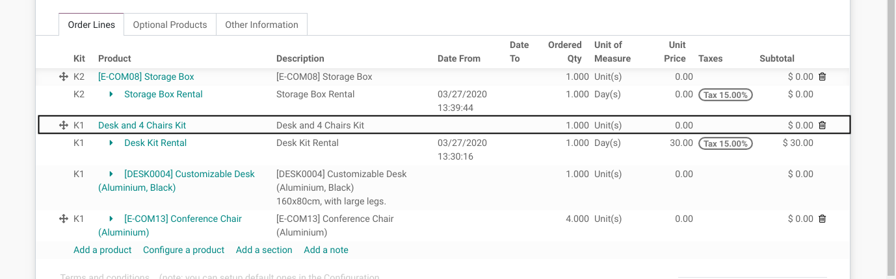

Contributors
------------
* Numigi (tm) and all its contributors (https://bit.ly/numigiens)

More information
----------------
* Meet us at https://bit.ly/numigi-com
