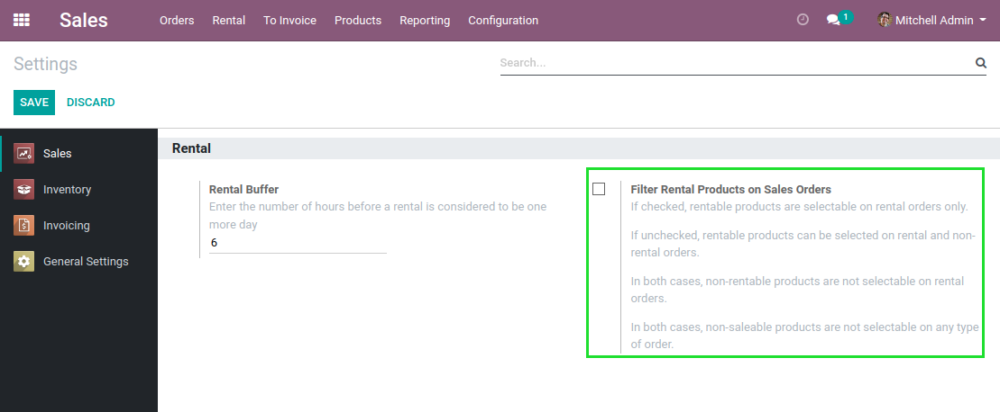

Sale Rental
===========
This module allows to rent products using the ``Sales`` application.

.. contents:: Table of Contents

Product Configuration
---------------------
In the form view of a product, I notice a new checkbox ``Can Be Rented``.

When the box is checked, in the ``Sales`` tab, a new field `Rental Service`_ appears.

.. image:: static/description/product_rental_service.png

Rental Service
~~~~~~~~~~~~~~
This field allows to select the product used to invoice the customer based on the number of rental days.

I create a new product for the rental service.

.. image:: static/description/product_rental_service_new.png

The product type must be ``Service`` and the unit of measure must be ``Day(s)``.
Otherwise, an error message will be raised when the rentable product is saved.

Kit
~~~
A product that can be rented can also be a `kit <https://github.com/Numigi/odoo-sale-addons/tree/12.0/sale_kit>`_.

.. image:: static/description/product_kit.png

When a rentable product is a kit, the product is considered delivered and returned
when all important components of the kit are delivered / returned.

System Configuration
--------------------
In General Settings --> Sales, there is a new configuration option called ``Rental``.

The parameter ``Rental buffer`` determines the location buffer. Here it is set at 6 hours.

Thus, the first product is rented for exactly one day, and the second product is rented for two days.

Menu
----
In the ``Sales`` application, I notice a new menu ``Rental``.

This menu allows to access sale orders and quotations of type ``Rental``.

Sale Order
----------
I create a new sale order.

I notice a new checkbox ``Is Rental``.

..

    This box is automatically checked when creating a quotation from the rental menu.

When checked, new columns are added to the sale order lines.

.. image:: static/description/sale_order_line_extra_columns.png

Sale Order Lines
~~~~~~~~~~~~~~~~
In a new line, I select my rentable product.

.. image:: static/description/sale_order_line_new.png

Automatically, when the product is selected, a new line is added below for the rental service associated to this product.

.. image:: static/description/sale_order_line_rental_service.png

I notice that:

1. The rental service line can not be moved (see `Moving Sale Order Lines`_).
2. The product can not be changed.
3. The unit of measure is day(s) and can not be changed.
4. The line can not be deleted.

The rental start date is automatically set to the current date.

I manually change the start date and select an end date.

The number of days is filled automatically.

Confirmation
~~~~~~~~~~~~
After confirming the sale order, 2 smart buttons appear.

.. image:: static/description/sale_order_picking_buttons.png

When I click on the ``Delivery`` button, I see the delivery picking.

The delivery is automatically scheduled for the rental start date.

.. image:: static/description/sale_order_pickings_delivery.png

When I click on the ``Receipt`` button, I see the return picking.

The return is automatically scheduled for the rental end date.

Delivery
~~~~~~~~
The delivery stock picking of a rented product works the same way as in a standard sale.

.. image:: static/description/picking_delivery.png

When the product is delivered, the delivered quantity of the rental service
is computed based on the rental start date.

..

    Delivered Qty = (Rental Start Date - Current Date) + 1 Day

When a rented product is delivered but not returned,
the delivered quantity of the rental service is updated every day based on a cron.

Also, when a product is delivered, the rental start date is automatically set to the current date.

Receipt
~~~~~~~
The return stock picking of a rented product is similar to a receipt picking.

.. image:: static/description/picking_receipt.png

When the product is returned, the delivered quantity of the rental service
is equal to the ordered quantity.

The rental start and end date can be edited manually.
This allows to adjust what must be charged to the customer based on your company's policies.

Also, when a product is returned, the rental end date is automatically set to the current date.
The number of days is updated based on the start and end dates.

Renting a Kit
-------------
Instead of a stockable product, you may select a kit on a rental sale order.

In this case, the rental service is added above the first component of the kit.

.. image:: static/description/sale_order_with_kit.png

Delivered Quantities
~~~~~~~~~~~~~~~~~~~~
When renting a kit, the delivered and returned quantities are
computed based on the important components.

..

    A kit is considered delivered when all important components are delivered.
    It is considered returned when all important components are returned.

Advanced Usage
--------------

Moving Sale Order Lines
~~~~~~~~~~~~~~~~~~~~~~~
A rental service line can not be moved.

However, if the related rented product or kit is moved, then the rental service will follow.
This is the same behavior as for the components of a kit.

.. image:: static/description/sale_order_line_moved_before.png

Filtering Products on Sales Orders
~~~~~~~~~~~~~~~~~~~~~~~~~~~~~~~~~~
Since version ``14.0.1.0.0`` of the module, a new configuration parameter is available.

When the box is checked, products with the box ``Can be Rented`` checked are not selectable on non-rental orders.

Contributors
------------
* Numigi (tm) and all its contributors (https://bit.ly/numigiens)

More information
----------------
* Meet us at https://bit.ly/numigi-com