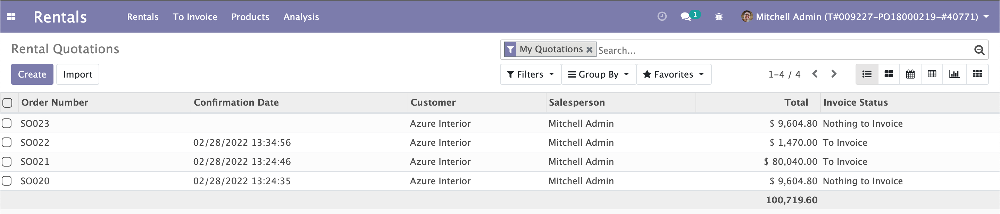
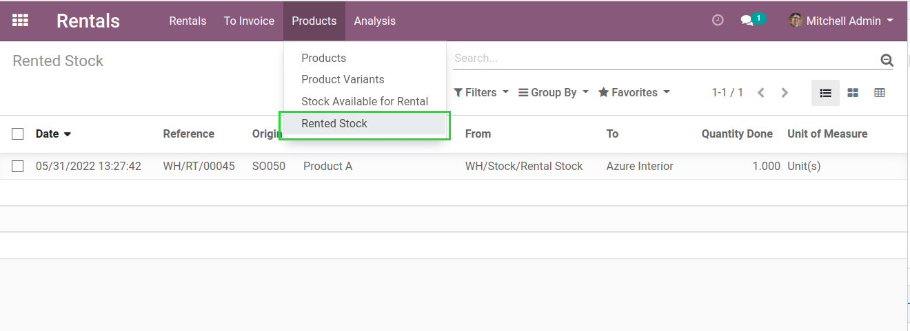

Sale Rental App
===============

.. contents:: Table of Contents

Description
-----------
This module adds a new Rentals application.

Rented Stocks
-------------
To see a list view of currently rented products, go to ``Rentals / Products / Rented Stocks``, 

The column ``To`` contains the customer instead of the destination location.

Known Issue
~~~~~~~~~~~
The ``Rented Stocks`` view only shows rental operations that are not fully returned.

In case where 2 products of the same type (with different serial numbers)
were shipped together but only one returned, both products would appear in the list view.

Contributors
------------

* The `Numigi <https://numigi.com/r/home>`_ team is the contributor to this project. We help Quebec companies implement Odoo and Konvergo ERP.
* Komit (https://komit-consulting.com)

