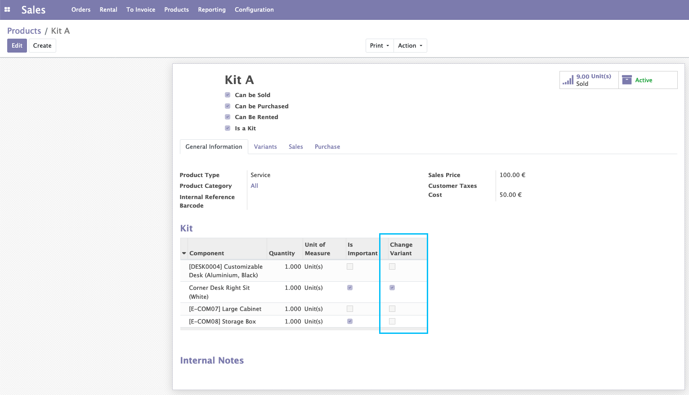
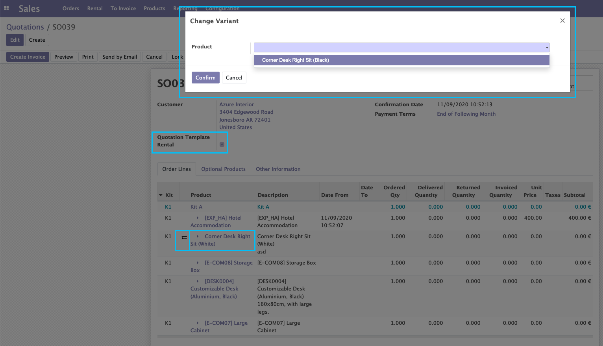
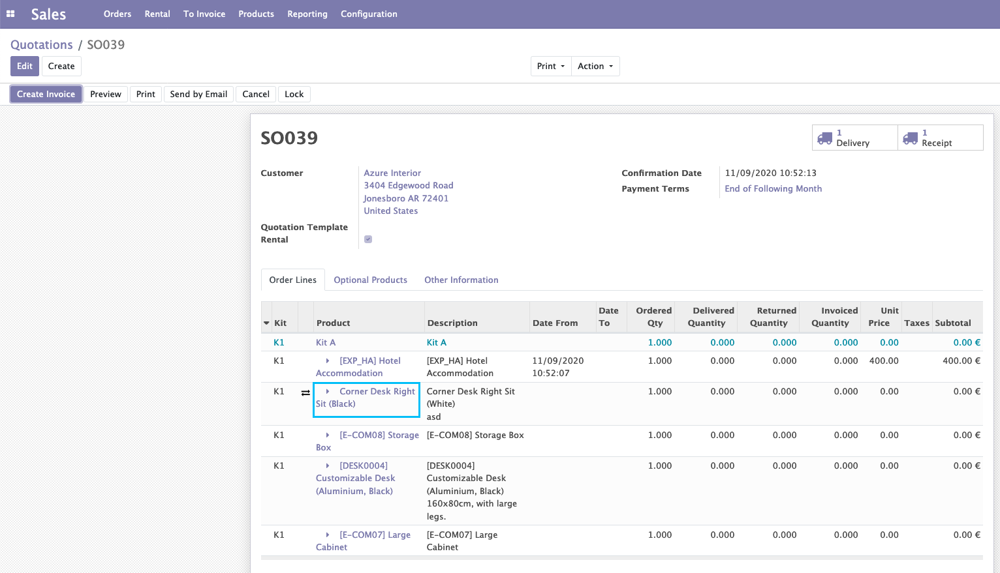
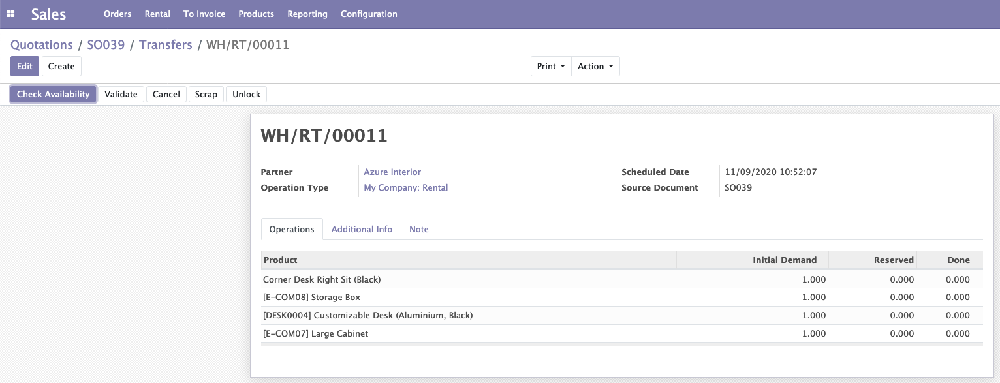
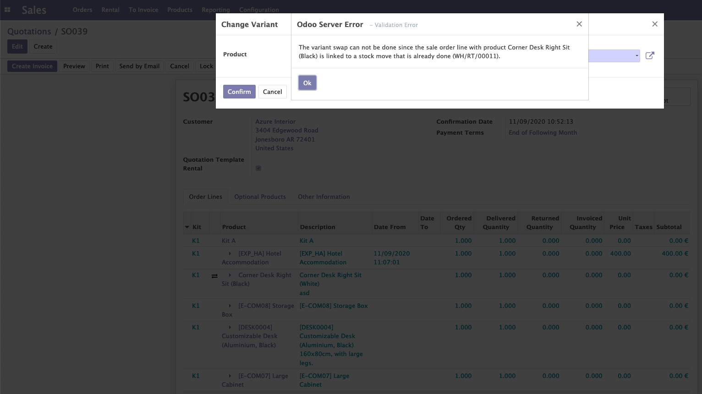

Sale Rental Order Swap Variant
==============================
This module adds a new option on kit products to allow user to swap the kit component's products for another variants from a rental sale order.

Configuration
-------------

- I open a type Kit product. In the configuration of the Kit, I have a new option to Change Variant.
- This option is only available for products which are important.
- I check this option.

Use
---

- I create a rental SO with a kit product that containing a product which Variant Change enabled.
- I confirm the SO. A new button appears next to Variant Change product. If I click on it, a wizard opens.
- The wizard only allows me to choose another product variant of the same product template.

- I confirm the wizard.
- The article has been changed on my SO line.

- If I go to the related pickings (delivery, reception), the article has also been amended.

Constraints:

- Product Variant change is not possible if related goods movements have already been confirmed.
- If, for example, my Variant Change product has been delivered and I try to change the variant, I get the following blocking error message:

Contributors
------------
* Numigi (tm) and all its contributors (https://bit.ly/numigiens)
* Komit (https://komit-consulting.com)

More information
----------------
* Meet us at https://bit.ly/numigi-com
