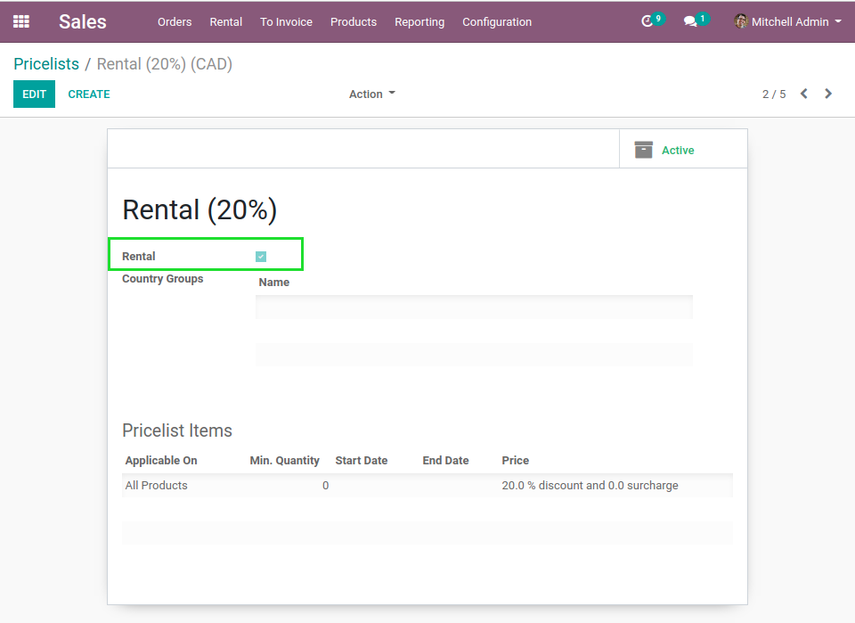
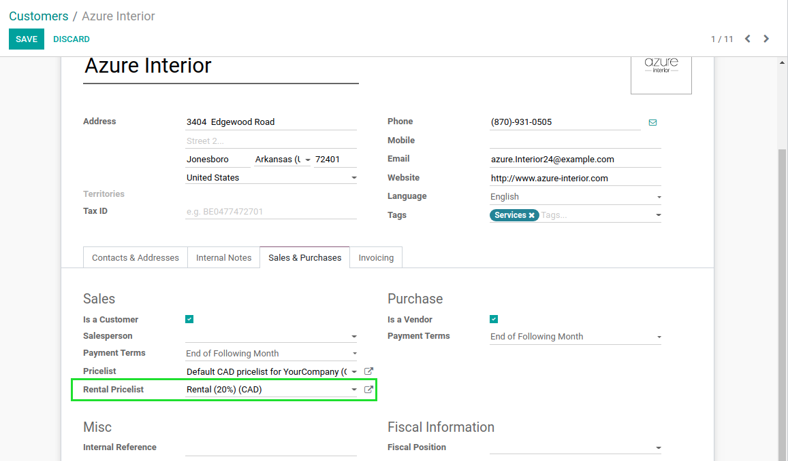
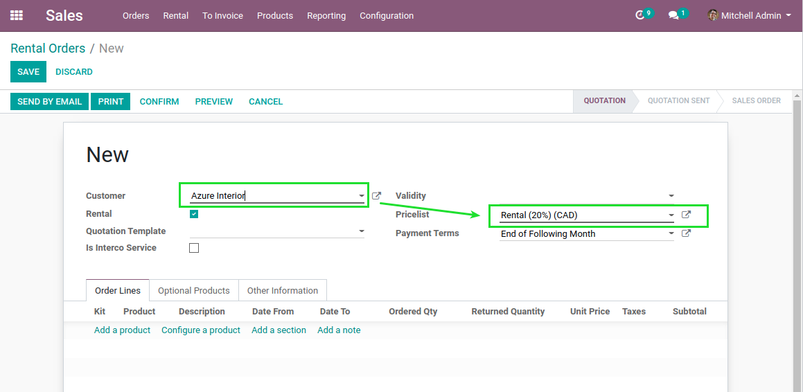

Sale Rental Pricelist
=====================
This module allows to define distinct pricelists for rental.

.. contents:: Table of Contents

Configuration
-------------

Pricelists
~~~~~~~~~~
I go to the form view of a pricelist.

I notice a new checkbox ``Rental``.

Partners
~~~~~~~~
I go to the form view of a commercial partner.

I notice a new field ``Rental Pricelist``.

This field allows to select a pricelist of type ``Rental``.

Usage
-----
I create a new rental order.

After selecting my partner, I notice that the rental pricelist was propagated.

..

	This behavior only applies for orders of type ``Rental``.
	On normal sales order, the standard sales pricelist defined on the partner is used.

Contributors
------------

* The `Numigi <https://numigi.com/r/home>`_ team is the contributor to this project. We help Quebec companies implement Odoo and Konvergo ERP.

