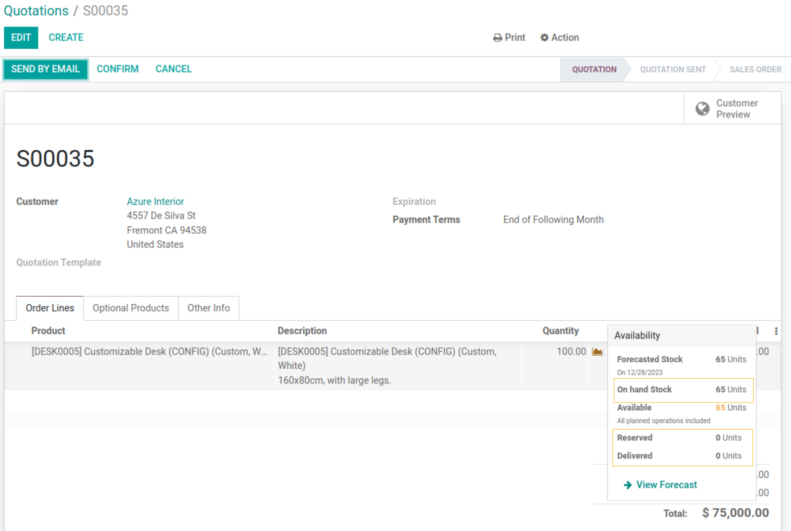
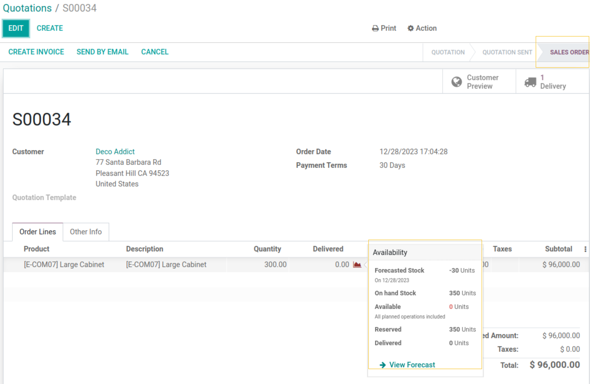

===============================
Sale Stock Availability Popover
===============================

This module extends the functionality of the 'sale_stock' module, modifying the behavior of the "QtyDetailPopOver" widget to provide more detailed information about stock.

Table of Contents
-----------------
- :ref:`Context`
- :ref:`Description`
- :ref:`Usage`
- :ref:`Contributors`
- :ref:`More Information`

Context
-------

When creating a Sale Order, the "QtyDetailPopOver" widget indicates the `Forecasted stock` and `Available Stock` in statuses `Quotation` and `Quotation Sent`. 
Upon confirming the Sale Order, the widget displays the `Reserved` stock of the current sale order. Once the delivery order is confirmed, the widget disappears. 
The goal is to show the widget in all sale order statuses with comprehensive stock information.

Additionally, the color of the chart icon is green when the available quantity is greater than the quantity requested, red when the quantity requested is greater, but there's no indication for partially available quantities.

Description
------------

This module introduces a yellow color to the chart icon, indicating a partially available requested quantity. 
It ensures the display of the "QtyDetailPopOver" widget in all sale order statuses, adding information on `On Hand Stock` and `Delivered` quantities. 
The widget now shows the reserved quantity of all stock operations instead of just the current sale order, and it is positioned to the right of the chart icon.

Usage
-----

As a user with access to the `Sale` App, create a new sale order:

.. image:: static/description/qty_partially_available_in_yellow.png
   :alt: Qty Partially Available

View detailed information about `On Hand Stock` and `Delivered` quantities in the widget popover:

After confirming the order, the "QtyDetailPopOver" widget continues to display all stock availability information:

Contributors
------------

- Numigi (tm) and all its contributors :numigi:`Numigi Contributors <https://bit.ly/numigiens>`

More Information
----------------

Visit us at :numigi:`Numigi <https://bit.ly/numigi-com>`
