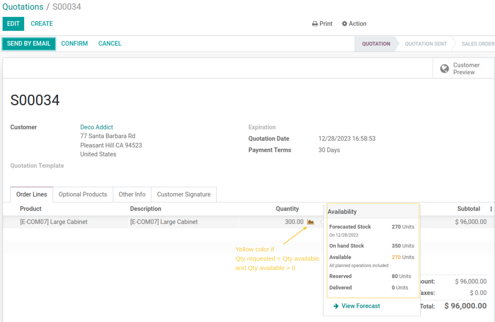

===============================
Sale Stock Availability Popover
===============================

This module extends the functionality of the 'sale_stock' module. 
It changes the widget "QtyDetailPopOver" behavior to provide more detailed information about stock.

**Table of contents**

.. contents::
   :local:

Context
-------

When I create a Sale Order, the widget "QtyDetailPopOver" indicates the `Forecasted stock` and `Available Stock` in statuses `Quotation` and `Quotation Sent`. 
When I confirm the Sale Order, the widget shows the `Reserved` stock of the current sale order. 
When I confirm the delivery order, the widget "QtyDetailPopOver" disappears. 
We would like to show the widget in all sale order statuses with all information stock.

I also noticed that the color of the chart icon is green if the available quantity is greater than the quantity requested or red if the quantity requested is greater than the available quantity. 
There is no option to indicate that the requested quantity is partially available.

Description
------------

The module adds a yellow color to the chart icon to indicate that the requested quantity is partially available. 
It displays the "QtyDetailPopOver" widget in all sale order statuses. 
It adds `On Hand Stock`, `Delivered`, and `To deliver` information in the "QtyDetailPopOver" widget. 
It shows the reserved quantity of all stock operations instead of the reserved quantity of the current sale order.
It displays the widget in the right of the icon chart.

Usage
-----

As a user with access to the `Sale` App, I create a new sale order:
I can see in this example that the requested quantity is partially available, and the chart icon is turned yellow.

I can also see information about `On Hand Stock`, `Delivered`, and `To deliver` quantities in the widget popover.

.. image:: static/description/qty_detailed_popover_info.png

I confirm my Order, and I notice that the widget "QtyDetailPopOver" still shows all stock availability information.

.. image:: static/description/qty_detailed_popover_sale_order.png

Contributors
------------
* Numigi (tm) and all its contributors (https://bit.ly/numigiens)

More information
----------------
* Meet us at https://bit.ly/numigi-com
