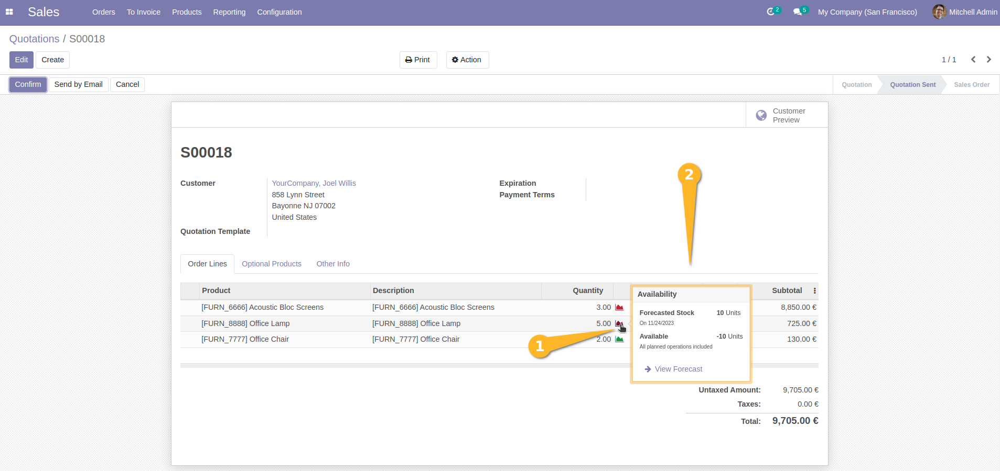

=============================
Sale Stock Availability Popup
=============================

This module extends the functionality of 'Sale Stock Info Popup' module
to add the a new availability level : available partially ( yellow color)
to the pop-up that show stock information at sales order line level.

**Table of contents**

.. contents::
   :local:

Usage
=====

To use this module, you need to:

#. Go to *Sales > Orders > quotations* and create a new one.
#. Add a sale order line with a storable product
#. On the icon popover in the line you will see the popover color of the
   corresponding product :

- Green if the ordered quantity is available in the stock
- Yellow if the ordered quantity is partially available in the stock
- Red if the ordered quantity is not available in the stock

Note: The available quantity is displayed in the popup even if the sale order is confirmed.

Since the version 1.1.3 :

As a Sales user, I go to the form view of a sale and add a storable item.
I point/click on the stock forecast widget and see that it appears on the right side.

Contributors
------------
* Numigi (tm) and all its contributors (https://bit.ly/numigiens)
