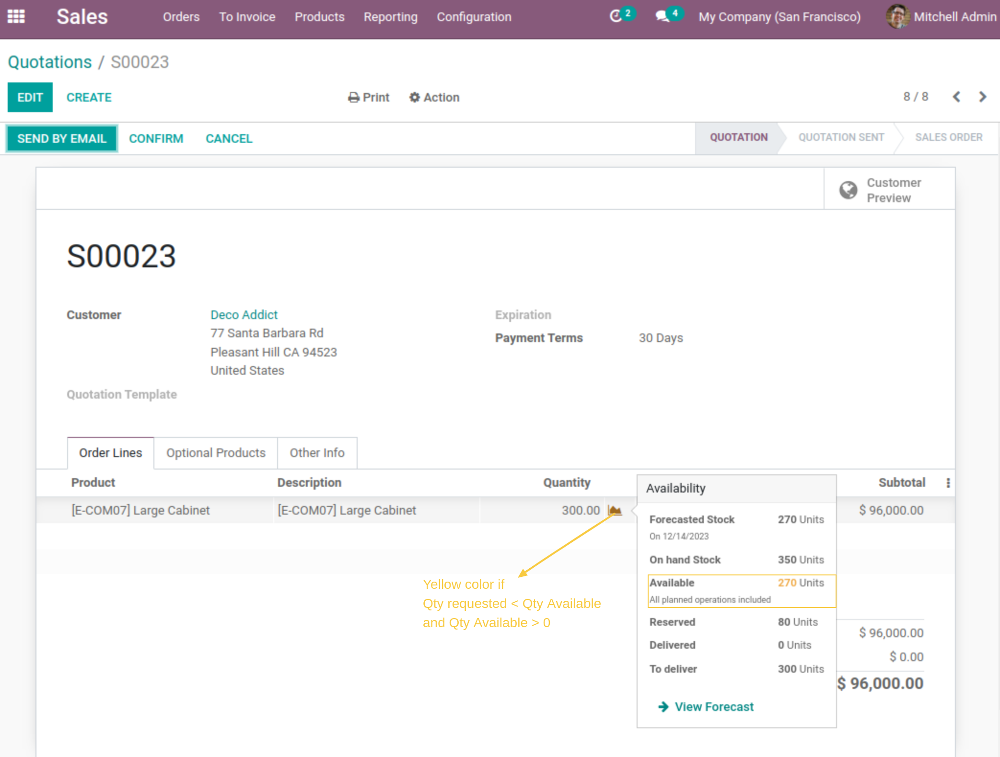
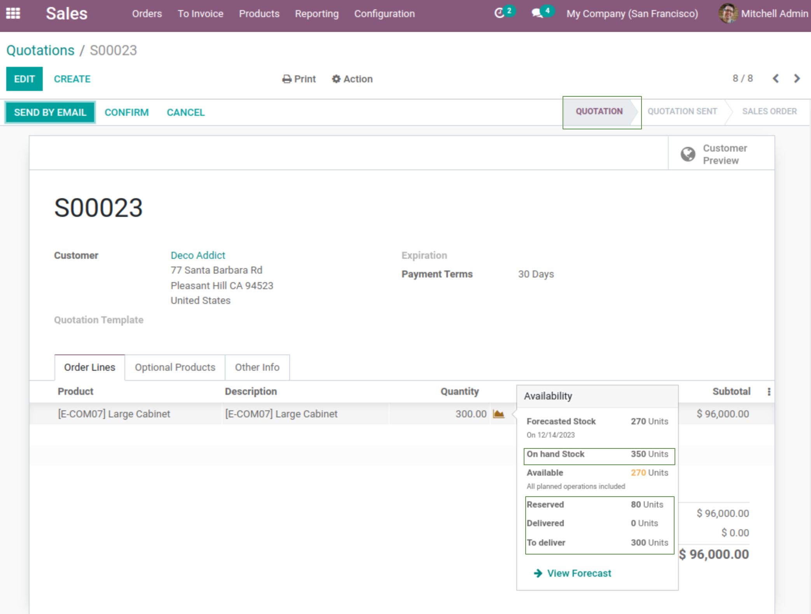
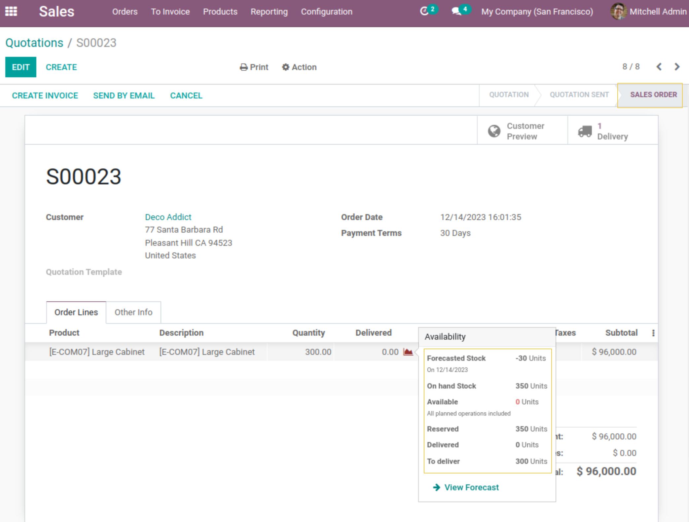

=============================
Sale Stock Availability Popup
=============================

This module extends the functionality of 'sale_stock' module.
It changes the widget "QtyDetailPopOver" behaviour to provide more detailed information about stock.

**Table of contents**

.. contents::
   :local:

Context
=======

When I create a Sale Order, the widget "QtyDetailPopOver" indicates the `Forcasted stock` and `Available Stock` in status `Quotation` and `Quotation Sent`.
When I confirm the Sale Order, the widget shows the `Reserved` stock of the current sale order.
When I confirm the delivery order the widget "QtyDetailPopOver" desapear.
we would like to show the widget in all sale order status.

I also notice that the color of the chart icon is Green if the available qty is greater than the qty requested or 
Red if the qty requested is greater than the available qty. 
There is no option to indicate that the requested qty is partially available.

Description
===========

The module adds yellow color of the chart icon to indicate that the requested qty is partially available.
It displays the "QtyDetailPopOver" widget in all sale order status. 
It adds `On Hand Stock`, `Delivered`, `To deliver` informations in the "QtyDetailPopOver" widget.
It shows the reserved quantity of all stock operations instead of the reserved quantity of the current sele order.

Usage
=====

As a user with access to Sale App, I create a new sale order:
I can see in this exemple that the requested quantity is partially available, the chart icon is turned to yellow

I can see also information about `On Hand Stock`, `Delivered`, `To deliver` quantities in the wiget popover.

I confirm my Order, I notice that the widget "QtyDetailPopOver" still shows all stock availability information.

Since the version 1.1.3 :

As a Sales user, I go to the form view of a sale and add a storable item.
I point/click on the stock forecast widget and see that it appears on the right side.

.. image:: static/description/forecast_widget_right_side.png

Contributors
------------
* Numigi (tm) and all its contributors (https://bit.ly/numigiens)
