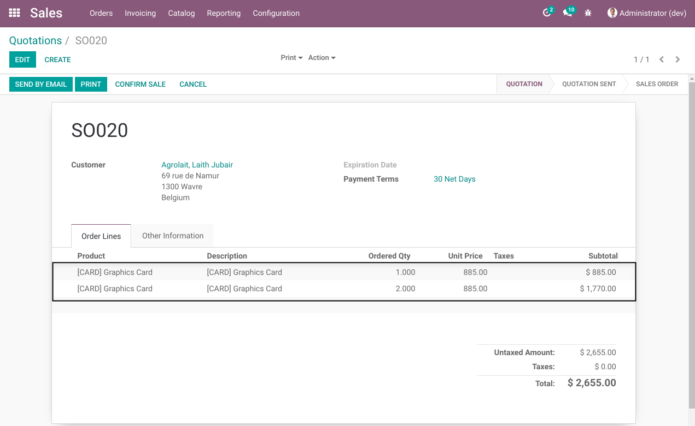
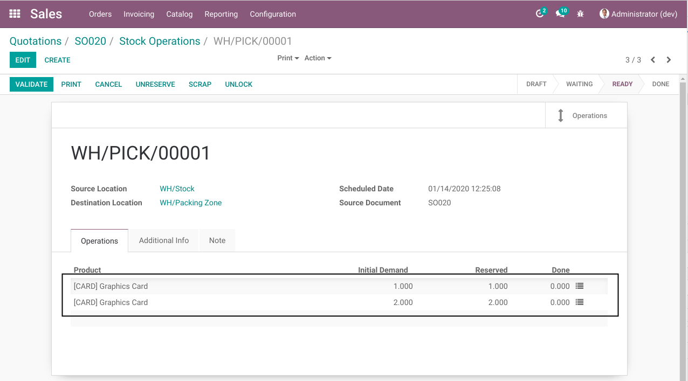

Sale Stock Move No Merge
========================
This module prevents Odoo from merging 2 stock moves from different sale order lines.

.. contents:: Table of Contents

Context
-------
In vanilla Odoo, in a same sale order, if you create 2 lines with the same stockable product,
2 stock moves will be created in the delivery order.

However, only one stock move will be created in the pick (or pack) operation.

Usage
-----
As member of the group ``Sale / User``, I create a sale order with 2 lines.

Each line contains the same product.

After confirming the sale order, in the form view of the pack operation,
I notice two stock moves instead of one.

Contributors
------------
* Numigi (tm) and all its contributors (https://bit.ly/numigiens)
