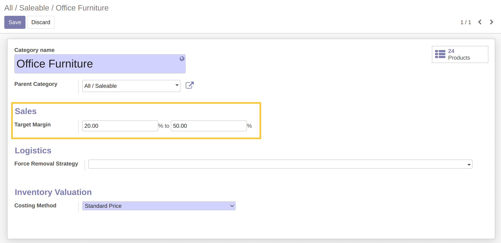
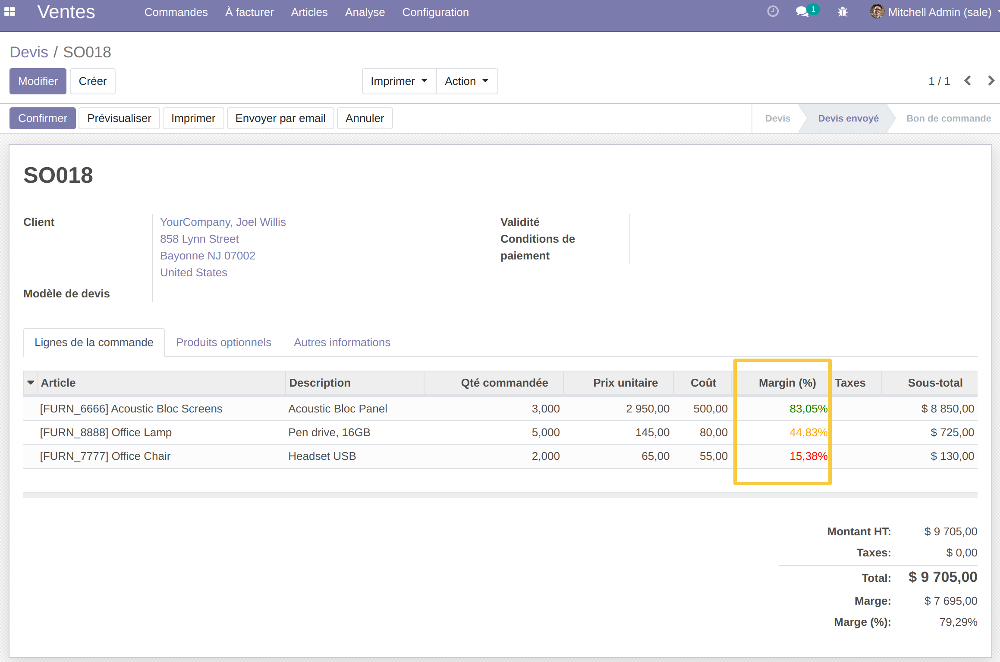

Sale Target Margin
==================

Overview
---------

This module allows to manage target sales margins.

Description
-----------

The module allows to determine, on a Product Category, a minimum and maximum target margin.

On the Sale Order Lines, the Margin (%) will change color according to the minimum and maximum target margin defined.

Color indicators are:

* Green: a sale price for which the margin (%) is higher than the defined maximum target margin.
* Orange: a sale price for which the margin (%) is within the defined target margin interval.
* Red: a sale price for which the margin (%) is lower than the defined minimum target margin.

Usage
------

1- Go to the form view of Product Category.
A new Sales section is present with the following 2 fields:

* Min. Target Margin
* Max. Target Margin

Set the 2 fields. The set minimum margin must be lower than the set maximum margin.

2- Create a Sale Order, add a Product and define a Sale Price. 

The Margin (%) field will take the appropriate color based on the Target Margin defined on the Category of the Product.

Contributors
------------
* Numigi (tm) and all its contributors (https://bit.ly/numigiens)

More information
----------------
* Meet us at https://bit.ly/numigi-com
