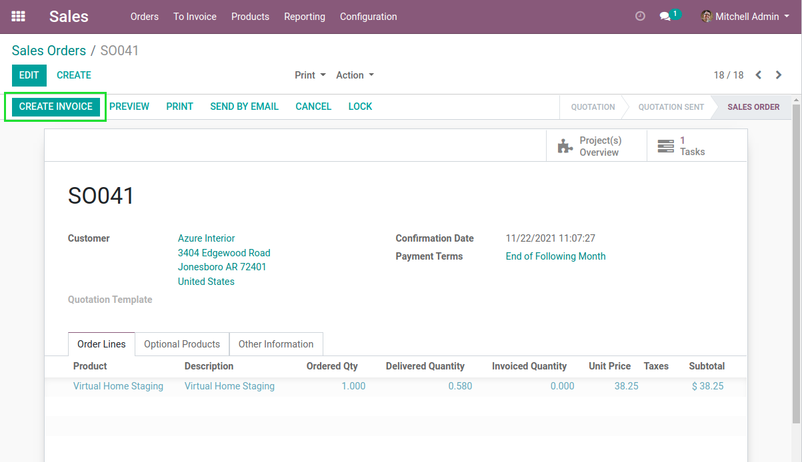
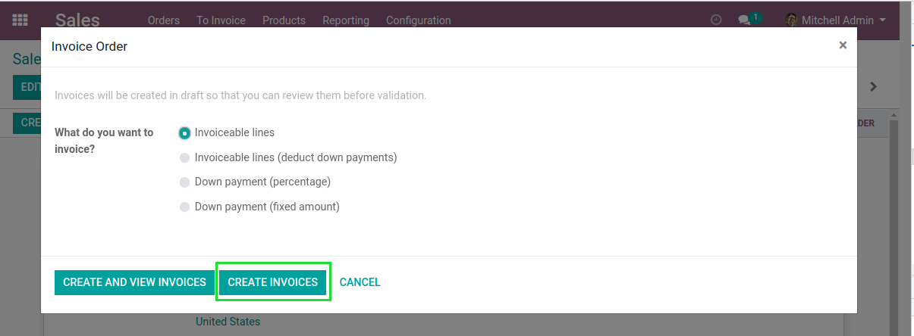
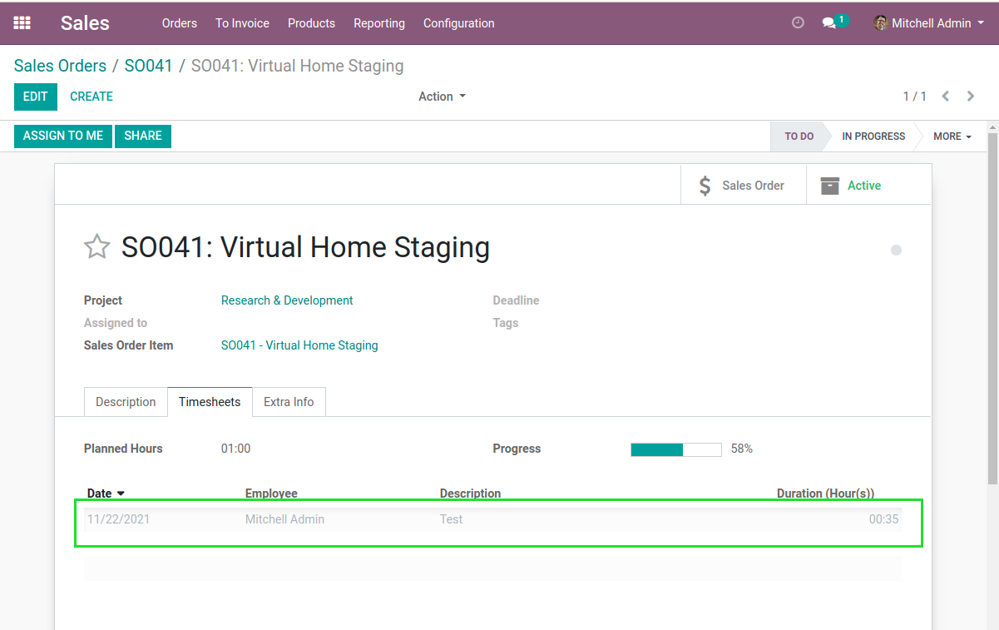
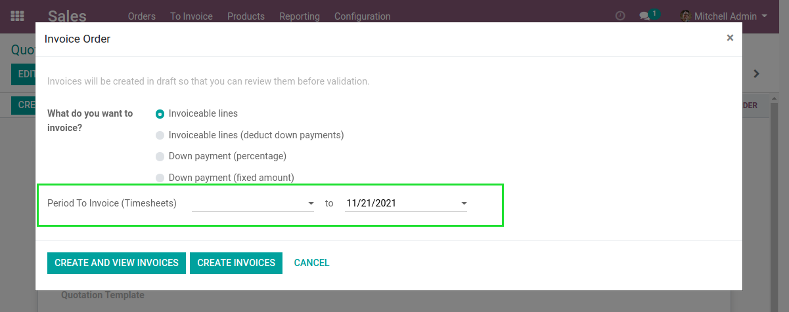
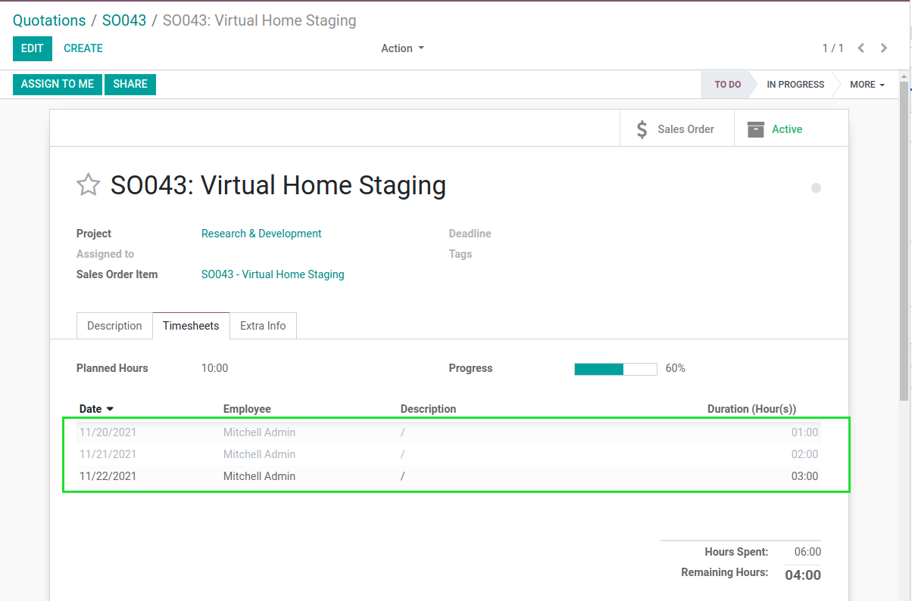

Sale Timesheet Invoicing Period
===============================
This allows to invoice timesheets based on a date range filter.

.. contents:: Table of Contents

Context
-------
In vanilla Odoo, when invoicing a sale order line linked to a task,
the invoice line is linked to the existing timesheets on this task.

The problem comes when invoicing work partially done on a task.

There is no way to (easily) invoice only timesheets prior to a given date.

Overview
--------
After installing this module, in the sale invoicing wizard, I can optionnaly enter a date range to
filter timesheets to invoice.

After creating the invoice, I notice that only timesheets within the specified date range are invoiced.

One timesheet line was not invoiced, because it did not match the selected date range.

Contributors
------------
* Numigi (tm) and all its contributors (https://bit.ly/numigiens)

More information
----------------
* Meet us at https://bit.ly/numigi-com
