Sales Warranty
==============
This module allows to manage warranties on sold products.

.. contents:: Table of Contents

Types of Warranty
-----------------
As member of the group `Warranties / Manager`, you may edit / create new types of warranties.

Go to `Warranties / Configuration / Warranty Types`.

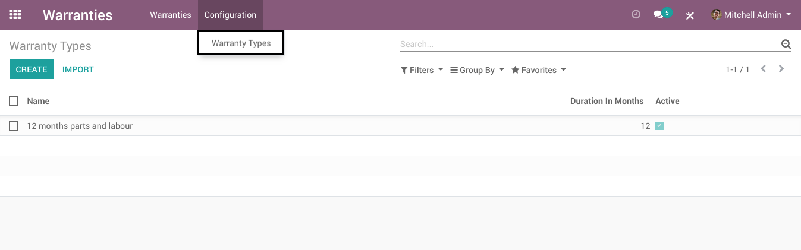

Products
--------
As member of the group `Sales / Manager`, you may select warranties on a product.

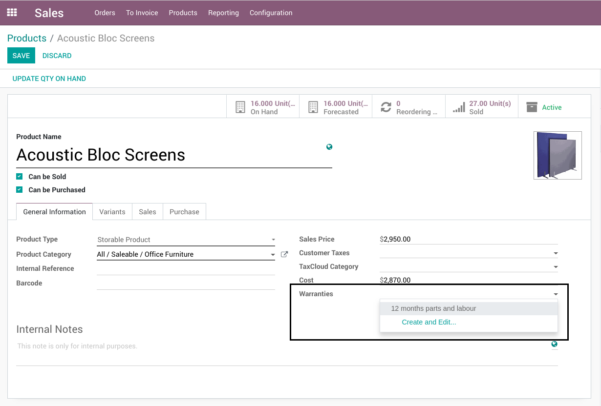

Warranties are only selectable on products with unique serial numbers.

Variants
~~~~~~~~
If you use product variants, note that all variants of the same product inherit the same warranty types.

Multi-Company
~~~~~~~~~~~~~
If you have multiple companies, note that each company has its own warranty types.
Therefore, each product has different warranty types per company.

Sale Order
----------
As member of the group `Sales / User`, when you validate a sales order,
warranties are created automatically for each product if required.

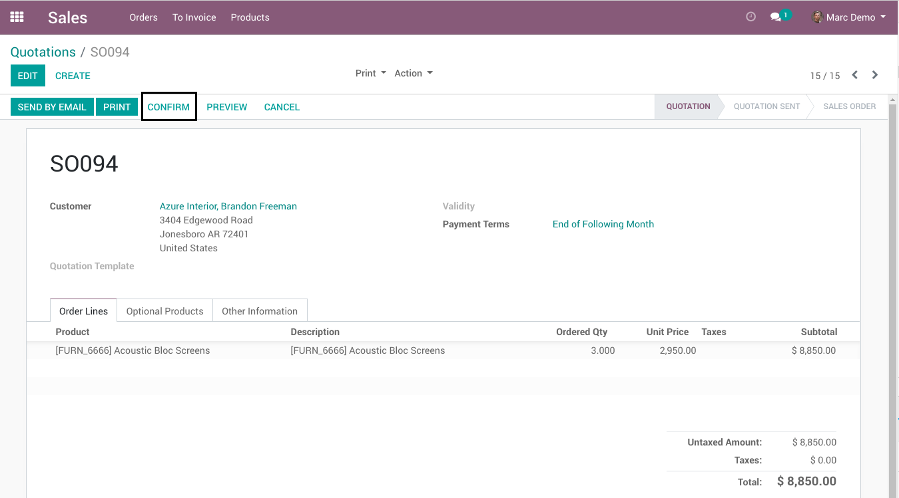

After validating the order, a smart button `Warranties` appears.
If you click on that button, the warranties related to the sold products appears.

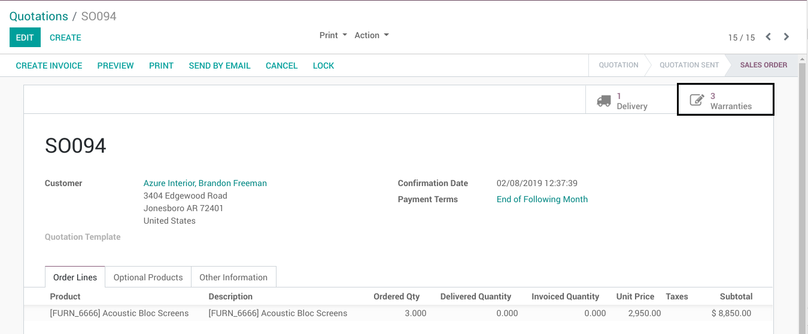
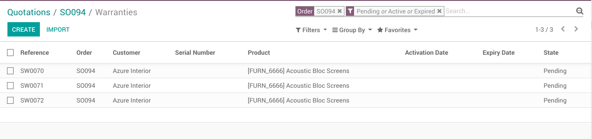

Each warranty inherits the details from the sale order.

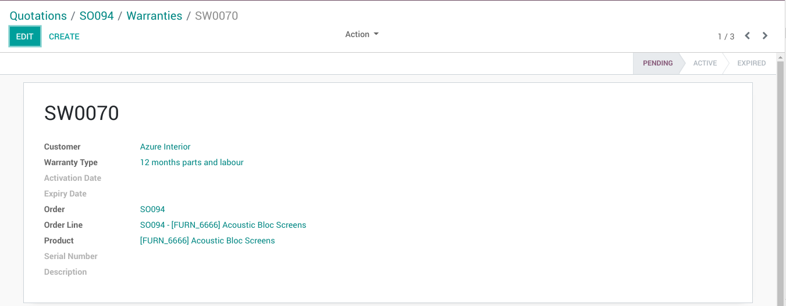

Note that some information are not filled on the warranty.

* Serial Number
* Activation Date
* Expiry Date

These 3 fields are only filled on the delivery of the product.

Delivery Order
--------------
As member of the group `Inventory / User`, when validating a delivery order,
the warranties related to the delivered products are activated.

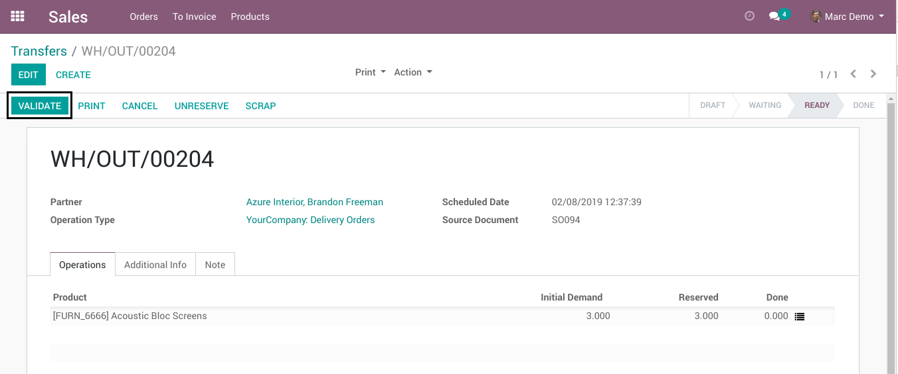

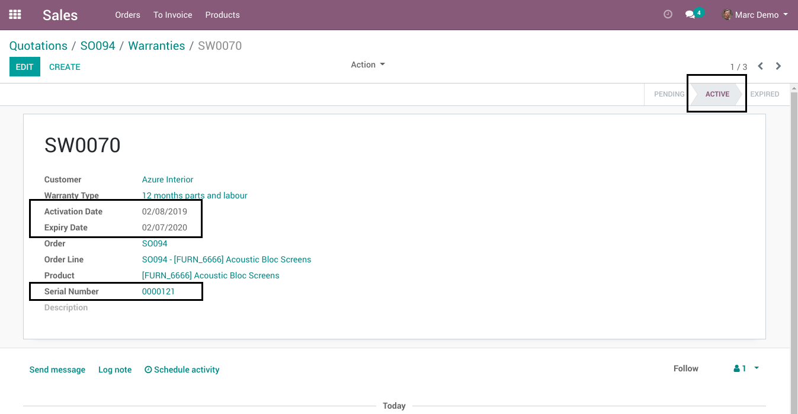

* The `Serial Number` selected on the picking is propagated to the warranty.
* The `Activation Date` is set to the current date.
* The `Expiry Date` is set based on the warranty type and the `Activation Date`.

End of Warranty
---------------
A cron job is executed every day to update the status of warranties.

If the current date is greater than the `Warranty End Date` on a warranty, it is changed to `Expired`.

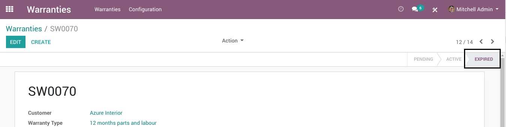

Creating Warranties Manually
----------------------------
As member of the group `Warranties / User`, you may create a warranty manually.

Go to `Warranties / Warranties / Warranties`, then click on `Create`.

Because the warranty is created manually, you must manually fill the serial number, activation date and expiry date.

When all the fields are filled, click on Save.

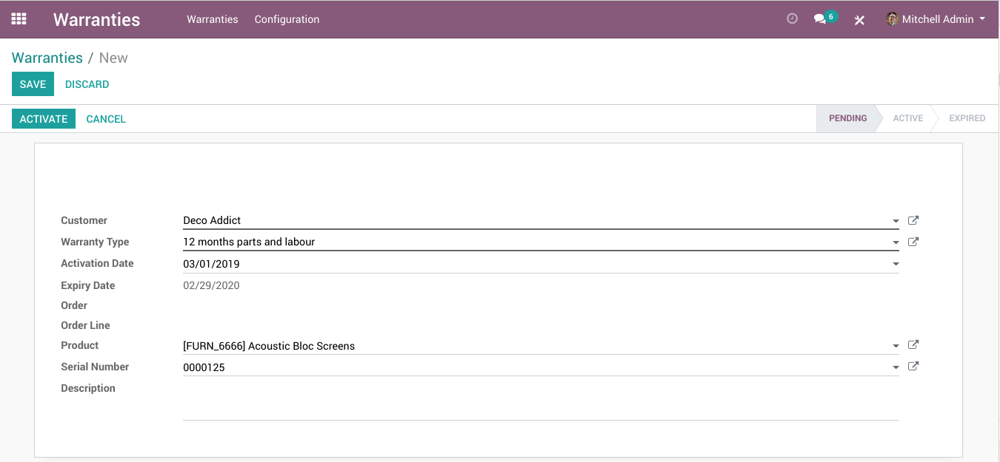

Then click on the button `Activate`.

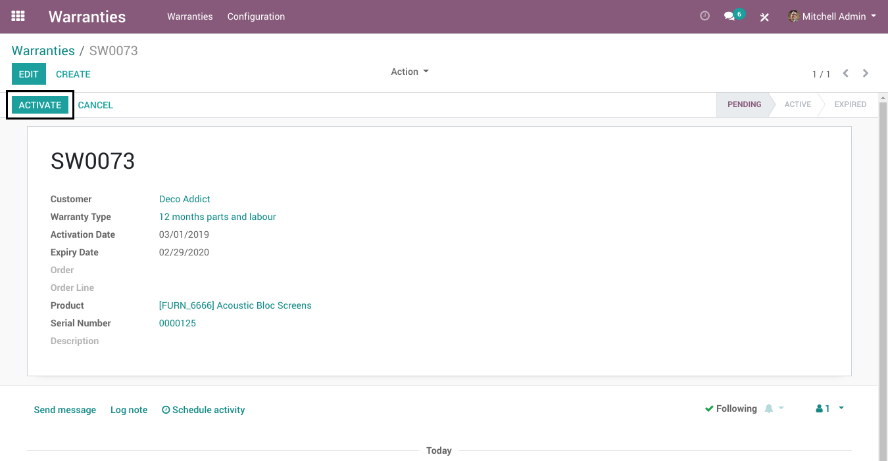

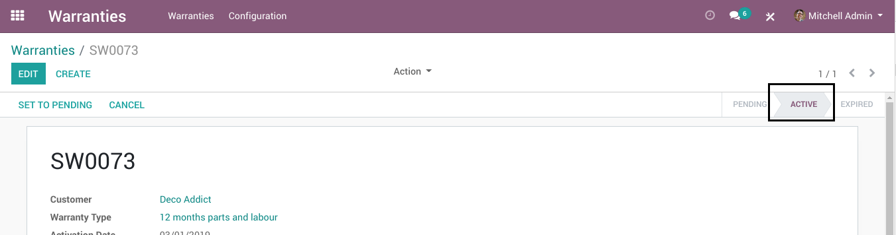

When the expiry date is reached, the state will be set to `Expired` by the cron.
This is the same behavior as for a warranty generated from a sale order.

Cancelling A Sale Order
-----------------------
When cancelling a sale order, the warranties attached to the order are cancelled.

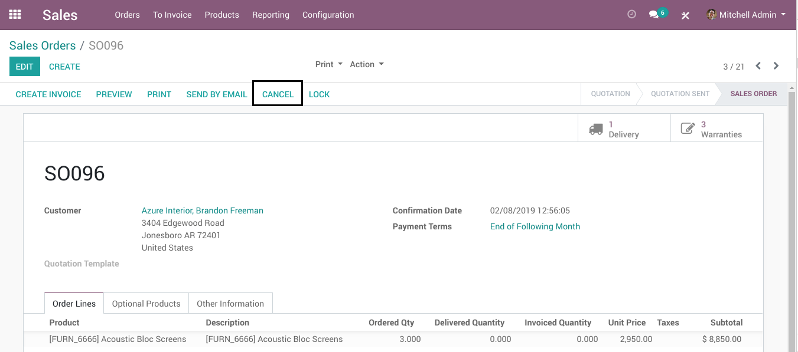

.. image:: static/description/sale_order_warranties_cancelled.png

If the sale order is reconfirmed after the cancellation, new warranties are generated.
The warranties previously cancelled are ignored.

Known Issues
------------

Delivering More Products Than Ordered
~~~~~~~~~~~~~~~~~~~~~~~~~~~~~~~~~~~~~
If delivering more products than ordered, only a subset of the delivered serial numbers will be attached to a warranty.
No blocking message will alert the user from such anomaly.

Contributors
------------
* Numigi (tm) and all its contributors (https://bit.ly/numigiens)

More information
----------------
* Meet us at https://bit.ly/numigi-com
