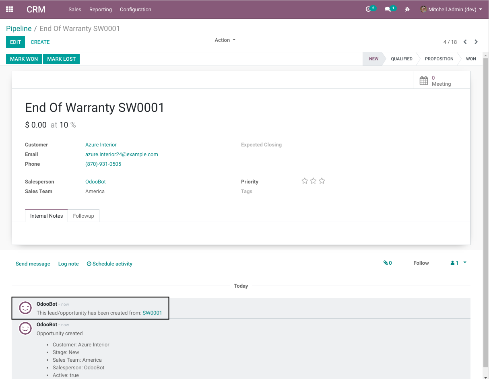

Sales Warranty Lead On Expiry
=============================
This module allows to generate automatically a lead when a sale warranty expires.

Configuration
-------------
As member of the group `Warranty / Manager`, I go to the form view of a warranty type.

I find a new block of fields `Automated Expiry Action`.

I check the box `Automated Warranty End Action`. I notice 3 new fields:

1. Sales Team

..

    This field indicates which sales team will be assigned the generated action for this type of warranty.

2. Days To Trigger Action

..

    This field indicates a delay in days after the warranty expiry.

    The action will be created after this delay.

Usage
-----
The new actions (leads) are generated by a cron. This cron is executed once per day by default.

1. The cron selects every expired warranties for which no action as been generated already.

2. For each of those actions, it evaluates if a lead must be created.

..

    A new lead should not be generated if the `Days To Trigger Action` (parametrized on the warranty type)
    has not been exceeded.

    A new lead should not be generated if the `Delay Between Leads` has not been exceeded.
    Refer to the section `Delay Between Leads` for more details.

3. A new lead is created.

Delay Between Leads
-------------------
If a customer has multiple warranties expired in the same period, only one lead will be generated
for this customer for the given period of time.

This prevents polution in the system.

As member of the `Warranty / Manager`, I can change the length of the period.
The period length is a global parameter per company.

To do so, I go to `Warranty / Configuration / Configuration`.

Contributors
------------
* Numigi (tm) and all its contributors (https://bit.ly/numigiens)

More information
----------------
* Meet us at https://bit.ly/numigi-com
