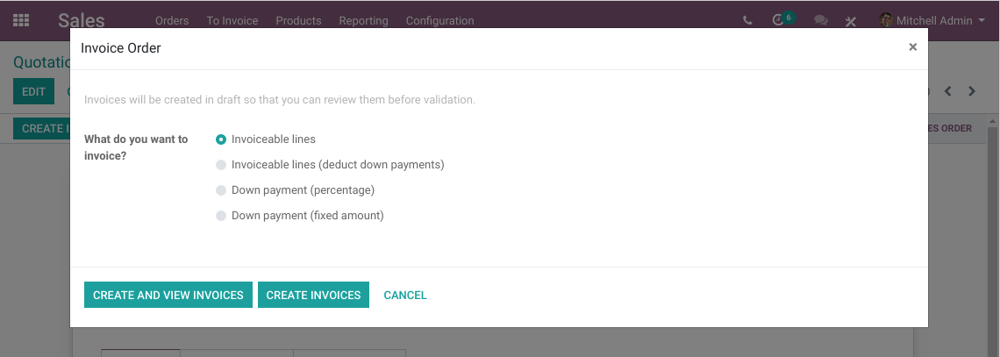
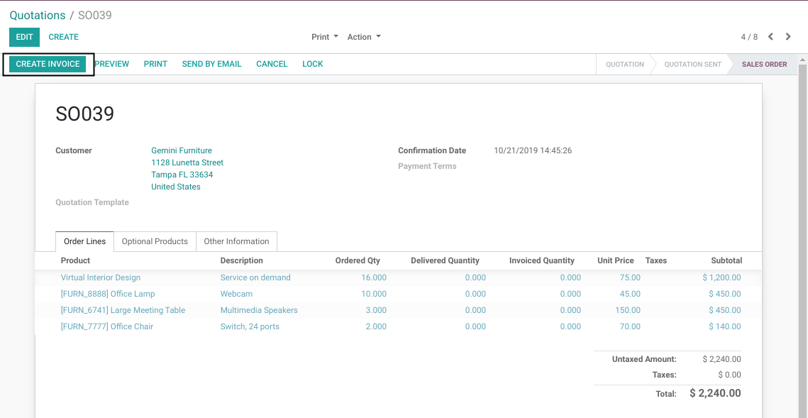
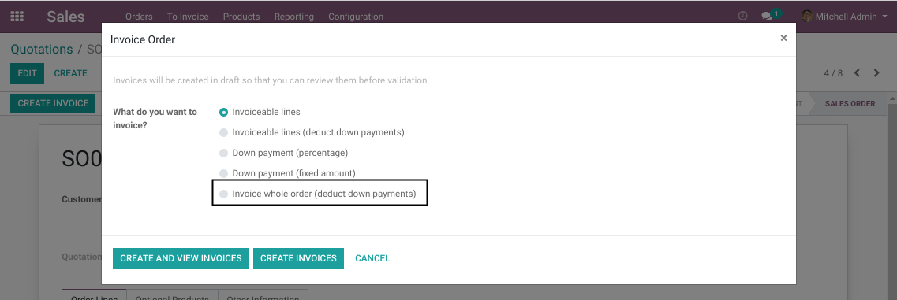
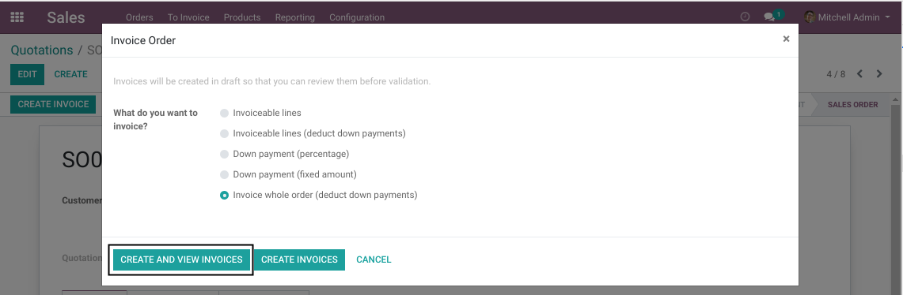
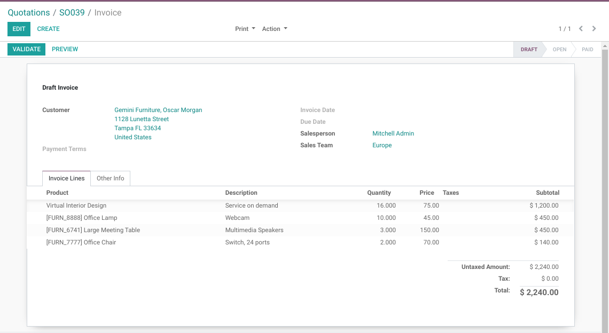
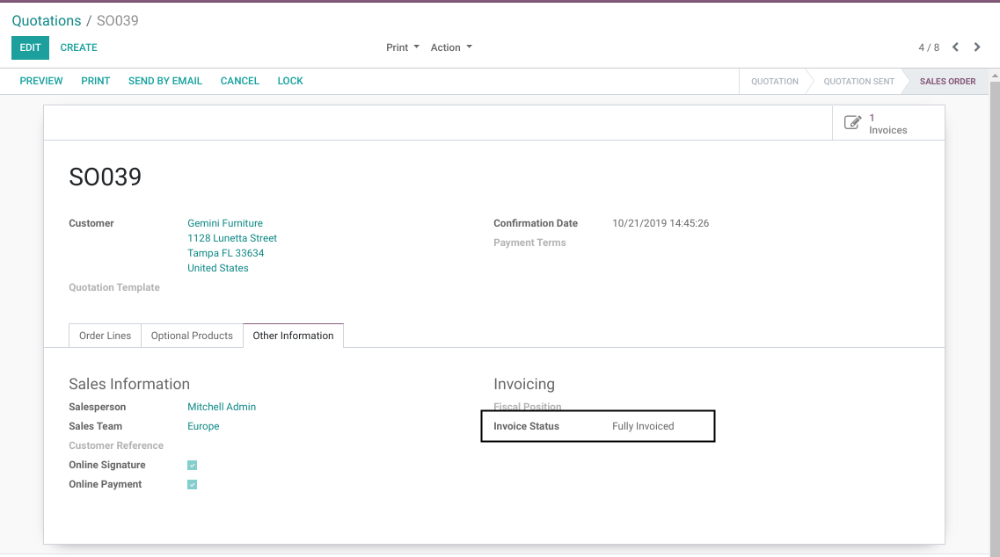

Sale Whole Order Invoiced
=========================
This module add an option to invoice a sale order entirely.

Context
-------
In vanilla Odoo, you have 4 options when invoicing a sale order:

* Invoiceable lines
* Invoiceable lines (deduct down payments)
* Down payment (percentage)
* Down payment (fixed amount)

None of these options implies that after creating the invoice, the order will be considered as invoiced.

The 2 first options only imply that some order lines will be invoiced based on their status.
Then, the sale order will be ``invoiced`` only if all lines have been invoiced.

In some cases, you may required to partially invoice an order, but consider the order entirely invoiced.
One example where this may apply, is if you organise a banquet and invoice the client based on the order (reservation).

Usage
-----
As ``Sale / User``, I go to a sale order.

I click on ``Create Invoice``.

In the invoicing wizard, I notice a new option ``Invoice whole order (deduct down payments)``.

I select this option, then click on ``Create and View Invoices``.

A new draft invoice is created.

Without validating the invoice, I go back to the sale order.

I notice that the order is fully invoiced.

Contributors
------------
* Numigi (tm) and all its contributors (https://bit.ly/numigiens)

More information
----------------
* Meet us at https://bit.ly/numigi-com
