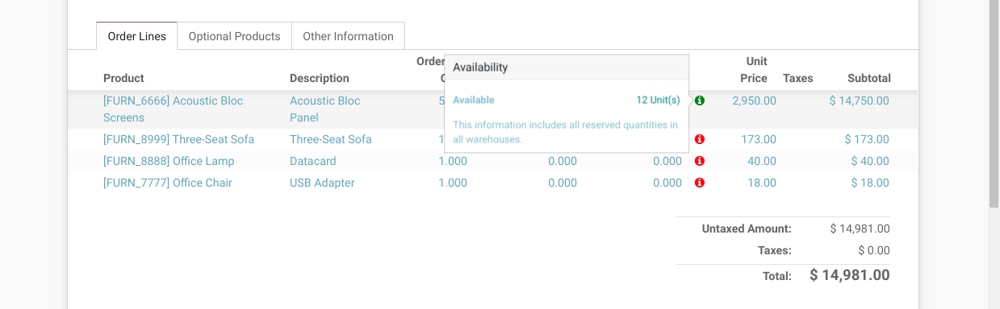
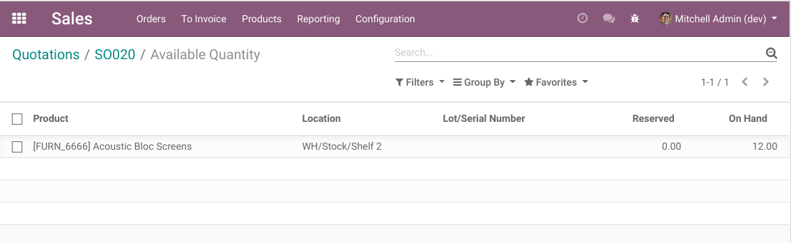

Sale Order Available Qty Popover Alternative
============================================
This module compute the product sale order line availability based on the chosen sale warehouse .

.. image:: static/description/sale_order.png

The color of the icon is:

* Red if the product is completely out of stock.
* Green if the product is available in stock warehouse set in the sale order.
* Yellow if the product is available including all warehouses.

When clicking on the quantity, the list of stock quants is shown.

Contributors
------------
* Numigi (tm) and all its contributors (https://bit.ly/numigiens)

More information
----------------
* Meet us at https://bit.ly/numigi-com
