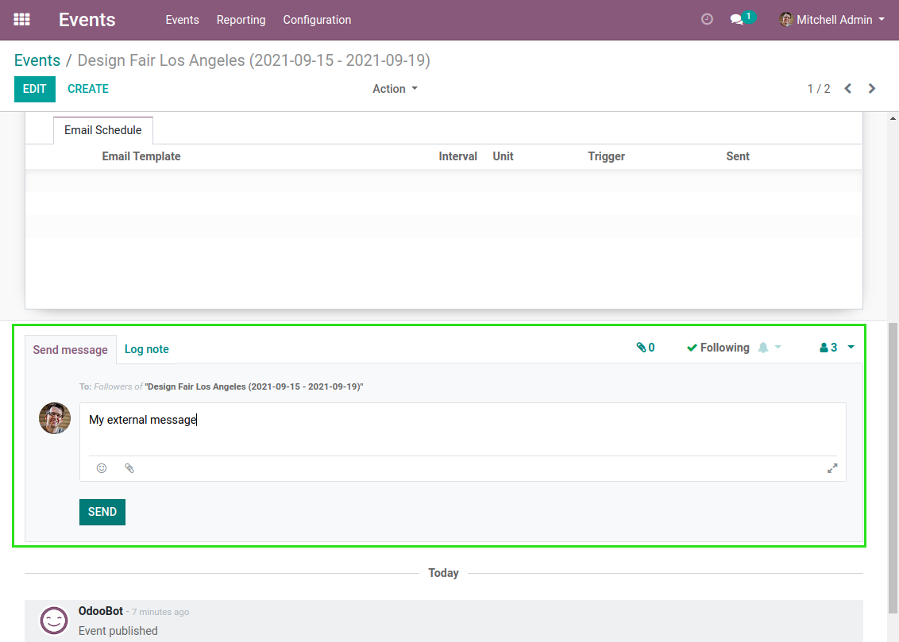
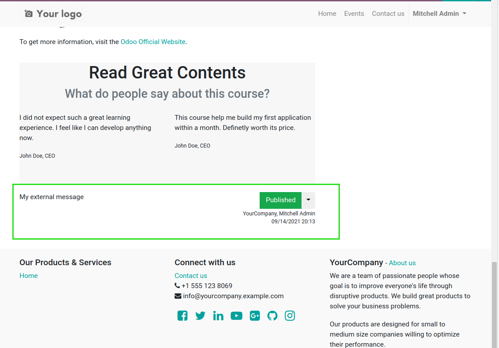
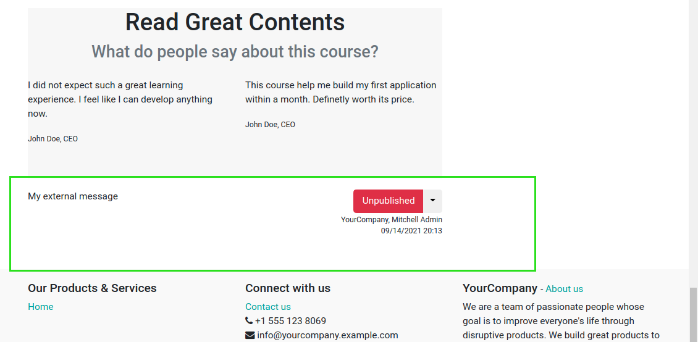

Website Event Message Unpublished
=================================

.. contents:: Table of Contents

Context
-------
By default, in Odoo, when you send a message from the thread of an event,
the message becomes ``published`` on the website.

Overview
--------
After installing this module, when you send a message from the thread of an event,
the message remains ``unpublished`` on the website.

Contributors
------------
* Numigi (tm) and all its contributors (https://bit.ly/numigiens)

More information
----------------
* Meet us at https://bit.ly/numigi-com
