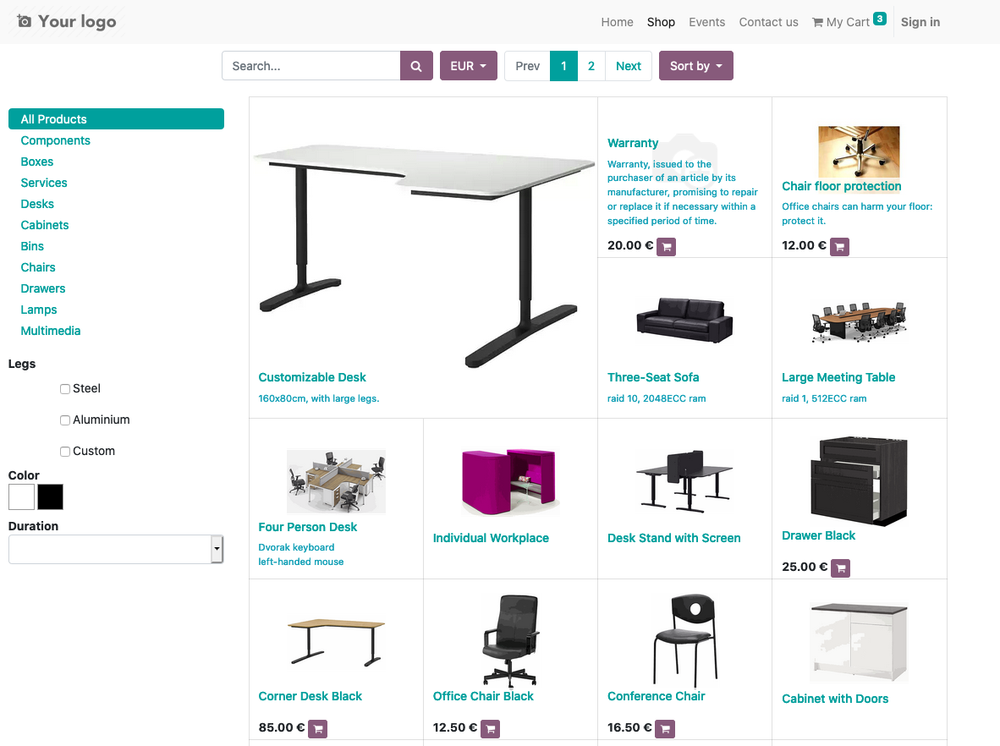

Website Sale Request Price
==========================
- This module adds an option to hide the price of a product when it reaches a threshold and allows the user to request for price through a form that will send an email to the sales team and create a CRM lead.

Module flow
-----------

- I go to the configuration of the Website. I find a new checkbox, if I press it, three new configuration options will show.

1. The first option allows me to define a price at which the price will not be displayed on the website.
2. The second option allows me to choose the email template used to send a quote confirmation email to the client.
3. The third option allows me to select the sales team used to create a pipeline/lead in the backend.

.. image:: static/description/website_sale_request_price_config.png

- As a logged in or non logged in user, I will in the shop. I see the price of the item that less than the threshold is hidden.

- I am going to the product sheet. The price is also hidden.
- Instead of the [Add to Cart] button, I find a new button [Request Price].

.. image:: static/description/website_sale_request_price_request_price_button.png

As a user not logged in, I click on the button [Request Price].
A wizard opens to allow me to fill in my details.

.. image:: static/description/website_sale_request_price_request_price_modal_not_login.png

- I confirm.
- An opportunity is created in the backend.
- The following information is automatically filled in:
1. Name: "Shop: {name of the variant}"
2. Email: field Email of the form
3. Telephone: field Telephone of the form
4. Team: sales team from config
5. Internal notes: field Additional Information of the form
6. Contact name: field name of the Form
7. Brand: the brand of the Product
8. Products: the Product

As a connected user, I click on the button. The wizard only allows me to fill in the field Additional Information, because my details are already known.

.. image:: static/description/website_sale_request_price_request_price_modal.png

- I confirm.
- An opportunity is created in the backend.
- The following information is automatically filled in:

1. Name: "Shop: {name of the variant}"
2. Customer: the partner linked to the user
3. Email: partner's email
4. Phone: partner's phone
5. Team: sales team from config
6. Internal notes: field Additional Information of the form
7. Brand: the brand of the Product
8. Products: the Product

- When the opportunity is created, a confirmation email is sent according to the template defined in the configuration.
- Details are available in the opportunity's chatter.

Configuration
-------------
- Configuration in Website section of General Settings

.. image:: static/description/website_sale_request_price_config.png

Contributors
------------
* Numigi (tm) and all its contributors (https://bit.ly/numigiens)
* Komit (https://komit-consulting.com)

More information
----------------
* Meet us at https://bit.ly/numigi-com
