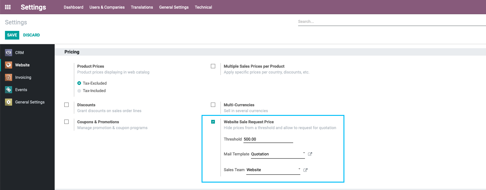
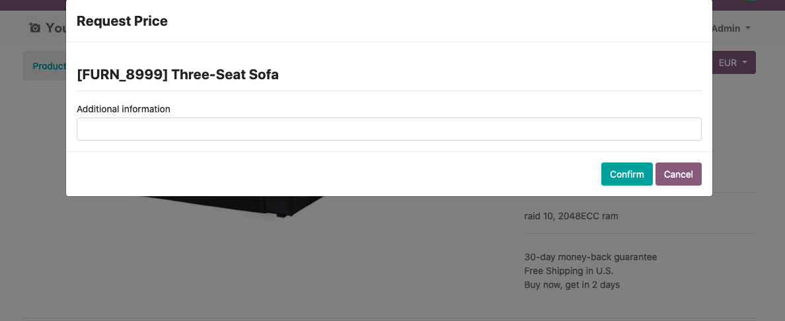
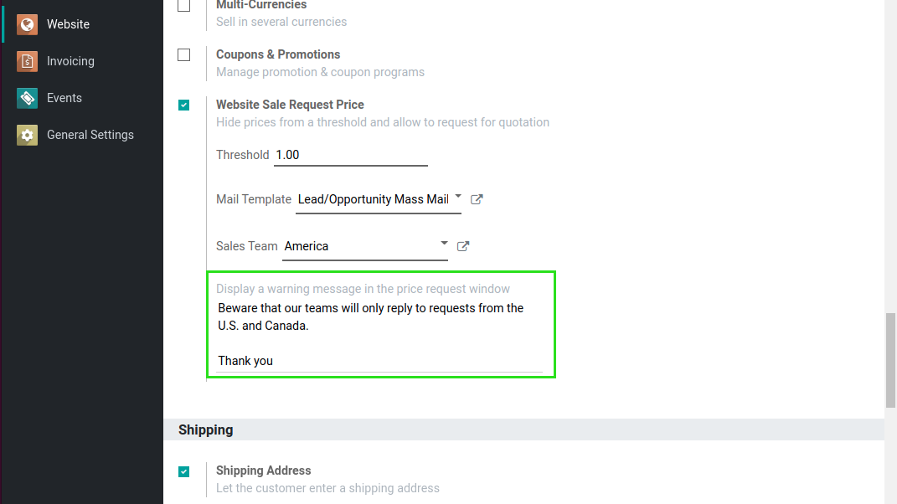
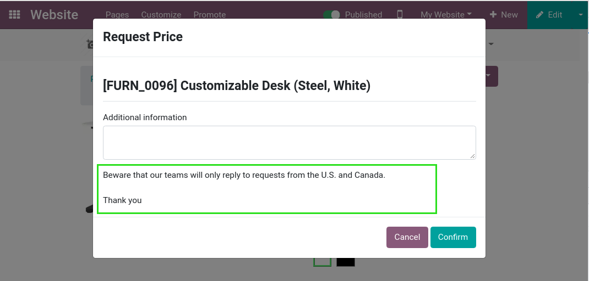

Website Sale Request Price
==========================
- This module adds an option to hide the price of a product when it reaches a threshold and allows the user to request for price through a form that will send an email to the sales team and create a CRM lead.

.. contents:: Table of Contents

Module flow
-----------

- I go to the configuration of the Website. I find a new checkbox, if I press it, three new configuration options will show.

1. The first option allows me to define a price at which the price will not be displayed on the website.
2. The second option allows me to choose the email template used to send a quote confirmation email to the client. The mail template must be linked to Lead/Opportunity model to keep track.
3. The third option allows me to select the sales team used to create a pipeline/lead in the backend.

- As a logged in or non logged in user, I see the price of the products and [Add to Cart] button only if the price is less than the threshold, otherwise [Request Price] button will appear

  + When going to the website shop, in the kanban of products:

  .. image:: static/description/website_sale_request_price_shop_kanban.png

  + When going to the website shop, in the list of products:

  .. image:: static/description/website_sale_request_price_shop_list.png

  + When going to the website product form, if the product has been configured optional products (note: Request Price button won't appear in this place):

  .. image:: static/description/website_sale_request_price_optional_products.png

  + When going to the website cart, in the suggested accessories:

  .. image:: static/description/website_sale_request_price_cart_suggested_accessories.png

- I am going to the product sheet. The price is also hidden if the price is above the threshold.
- Instead of the [Add to Cart] button, I find a new button [Request Price].

.. image:: static/description/website_sale_request_price_request_price_button.png

As a user not logged in, I click on the button [Request Price].
A wizard opens to allow me to fill in my details.

- I confirm.
- An opportunity is created in the backend.
- The following information is automatically filled in:
1. Name: "Shop: {name of the variant}"
2. Email: field Email of the form
3. Telephone: field Telephone of the form
4. Team: sales team from config
5. Internal notes: field Additional Information of the form
6. Contact name: field name of the Form
7. Brand: the brand of the Product
8. Products: the Product

As a connected user, I click on the button. The wizard only allows me to fill in the field Additional Information, because my details are already known.

.. image:: static/description/website_sale_request_price_request_price_modal.png

- I confirm.
- An opportunity is created in the backend.
- The following information is automatically filled in:

1. Name: "Shop: {name of the variant}"
2. Customer: the partner linked to the user
3. Email: partner's email
4. Phone: partner's phone
5. Team: sales team from config
6. Internal notes: field Additional Information of the form
7. Brand: the brand of the Product
8. Products: the Product

- When the opportunity is created, a confirmation email is sent according to the template defined in the configuration.
- Details are available in the opportunity's chatter.

Configuration
-------------
- Configuration in Website section of General Settings

Warning Message
---------------
Since version ``1.3.0`` of the module, it is possible to define an optional warning message.

This message will be displayed inside the price request window.

The message is defined per company and is translatable.

In order to translate the message, you need to reopen the website settings
in the proper language.

Roadmap
--------
- Add the support for the Comparison List: As admin in the website (Customize > Comparison List)

Contributors
------------
* Numigi (tm) and all its contributors (https://bit.ly/numigiens)
* Komit (https://komit-consulting.com)

More information
----------------
* Meet us at https://bit.ly/numigi-com
