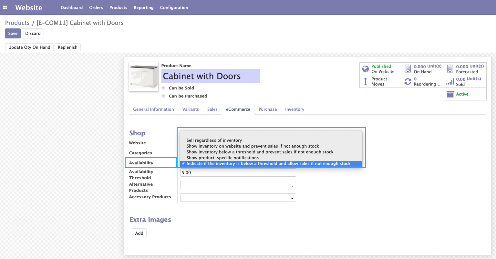
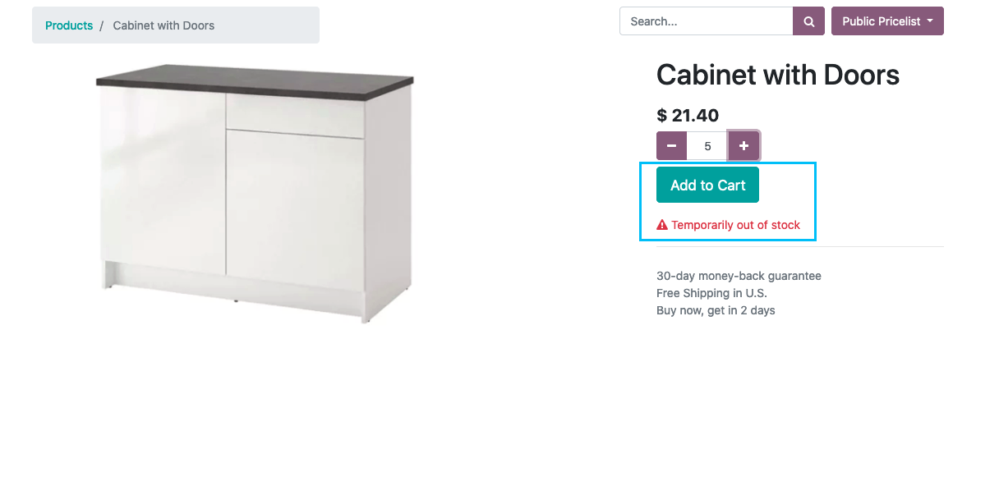
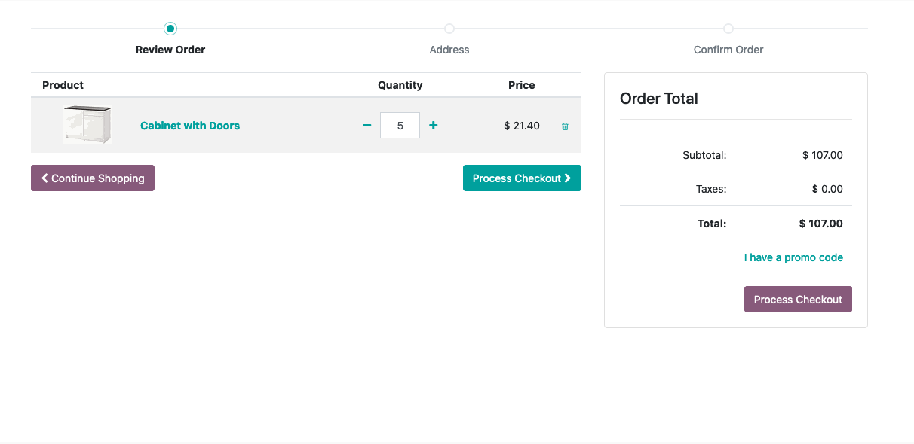

Website Stock Availability Enhanced
===================================
- New option on the product in the existing selection field of the E-commerce tab

  - "Availability": "Indicate if the inventory is below a threshold and allow sales if not enough stock"

- If the stock level is below the threshold, then the website should display the stock level
- If the product has no stock quantity, then display the existing "Temporarily out of stock" message, but the customer should still be allowed to buy.

Configuration
-------------
No configuration required apart from module installation.

Contributors
------------
* Numigi (tm) and all its contributors (https://bit.ly/numigiens)
* Komit (https://komit-consulting.com)

More information
----------------
* Meet us at https://bit.ly/numigi-com
