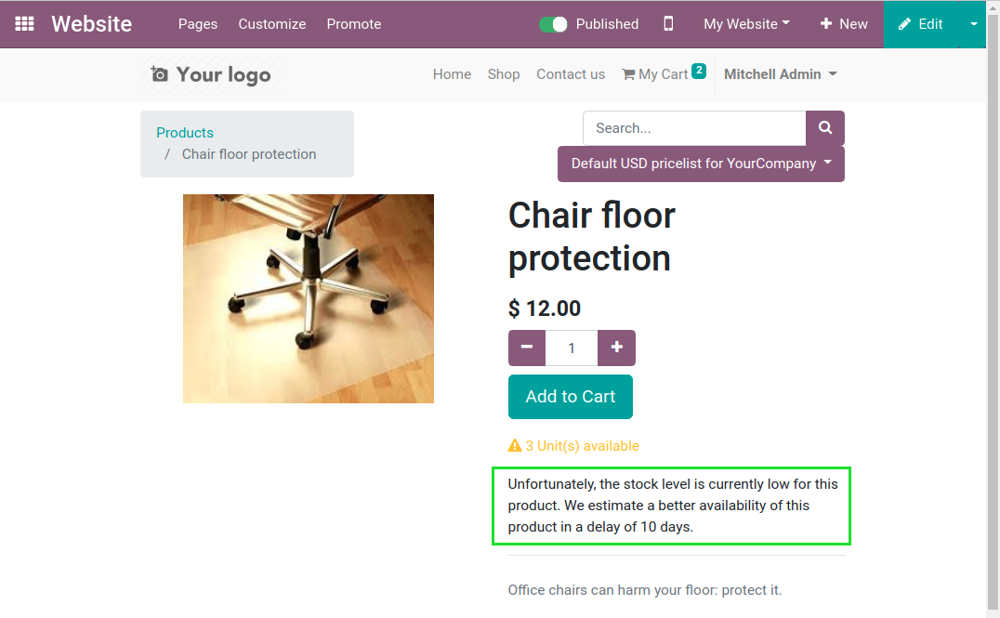

Website Stock Availability Enhanced
===================================
This module improves the stock availability on the e-commerce application.

.. contents:: Table of Contents

Context
-------
The e-commerce application in vanilla Odoo has limitations regarding the availability of products.

To determine whether a product is available for selling to a customer,
Odoo uses the ``Forecast Quantity`` (a.k.a. the virtual quantity).

This quantity includes products that are expected to be received in the future.

The big issue here is that sometimes, products can take multiple months to be received from the supplier.
It such case, you do not want your customers to expect their orders to be fullfiled soon.

Products
--------
This module adds 4 extra fields on products.

.. image:: static/description/product_form.png

1 - Prevent Sales Base On
~~~~~~~~~~~~~~~~~~~~~~~~~
In vanilla Odoo, sales are blocked if stock levels are below the ``Forecasted Quantity``.

When this module is installed, the ``Forecasted Quantity`` is never used to block a website sale.

The new field ``Prevent Sales Base On`` allows to select the metric that is used instead.

The available choices are:

* Quantity available for sales
* Quantity available including next replenishment

2 - Quantity Available For Sales
~~~~~~~~~~~~~~~~~~~~~~~~~~~~~~~~
This metric includes the current stocks in hand, minus the forcasted quantities to deliver.

It does not include any incoming quantity.

3- Quantity Available Including Next Replenishment
~~~~~~~~~~~~~~~~~~~~~~~~~~~~~~~~~~~~~~~~~~~~~~~~~~
This metric includes the quantity available for sales,
plus the quantity of this product to be received in the next replenishment shipment.

4 - Next Replenishment Delay
~~~~~~~~~~~~~~~~~~~~~~~~~~~~
This metric indicates the expected number of days until the next replenishment arrives.

If at least one replenishment shipment is scheduled for this product,
the expected date of this shipment is used.

Otherwise, the delay computed based on:

* The lead time defined on the main supplier for this product.
* Plus the sales and purchase lead time defined for the company.

In the above example, the estimated lead time would be:

..

	13 days = 8 days + 2 days + 3 days

Computation
~~~~~~~~~~~
These metrics are computed distinctly per company.

They are not computed based on the computing mecanisms of Odoo.
They are computed asynchronously based on `Queue Jobs <https://github.com/OCA/queue/tree/12.0>`_.

This prevents the module from significantly impacting the performance of the system.

Write operations on stock moves trigger the recomputation of the metrics for a given product.

Also, a cron job is predefined to execute once per day.
This cron triggers the recomputation of the metrics for all products.

Show Inventory Without Blocking
-------------------------------
This field ``Availability`` contains two distinct principles mixed together.

* Whether to show the stock level or not
* Whether to block sales on insufficent stock level

One case that is not covered by the choices is to show the stock levels without blocking sales.

The module adds the option to show inventory below a threshold and allow sales.

Replenishment Delay Message
---------------------------
In the website form of the product, messages are added in certain context.

If the quantity selected is between
the quantity currently available and the quantity available after the next replenishment,
a message will be displayed.

If the quantity selected is above the quantity available after the next replenishment,
the message will not be displayed.

After checking out the order, the delay displayed to the customer is written on the sale order line.

Contributors
------------
* Numigi (tm) and all its contributors (https://bit.ly/numigiens)
* Komit (https://komit-consulting.com)

More information
----------------
* Meet us at https://bit.ly/numigi-com
